# APEN 구현 결과 보고서

---

## 1. 서론

이 글은 APEN 논문(Karimi & Kwon, *Applied Energy* 326, 2022)의 제안 모형을 직접 코드로 구현해서 재현해본 과정을 정리한 글이다. 태양광 발전량을 다음 날 예측해서 하루 전 시장에 얼마나 팔지 정하는 문제인데, 이 논문은 예측 오차 자체가 아니라 "예측이 틀렸을 때 나는 손해"까지 목적함수에 넣어서 회귀 계수를 정한다. 논문 수식을 그대로 옮겨서 짜보고, 실제로 논문과 같은 결과가 나오는지 확인해봤다.

---

## 2. 논문 분석 및 고려 사항

논문을 재현하는 과정에서 실제로 부딪혔던 구현 이슈들을 정리한다.

### 2.1 Optimality gap이 음수가 된 이유

초기 구현에서는 일부 결과의 optimality gap이 음수로 계산됐다. optimality gap이 음수라는 건, actual solar generation을 알고 최적으로 약정했을 때의 profit보다 forecasted solar generation을 사용한 경우의 profit이 더 크게 계산됐다는 뜻이다. 그런데 실제 발전량을 사전에 알고 있다면 forecast uncertainty 없이 더 유리한 약정량을 선택할 수 있으니까, 값이 제대로 계산됐다면 optimality gap은 음수가 될 수 없다.

논문 Eq.(13)은 actual solar generation \(S_t\)를 알고 있을 때의 profit을 다음과 같이 계산한다.

$$
\max\{DP_t,RP_t\}S_t
$$

이는 두 가지 day-ahead commitment만 비교한 것이다.

* \(x_t=0\): day-ahead market에는 약정하지 않고 실제 발전량을 모두 real-time market에 판매
* \(x_t=S_t\): 실제 발전량만큼 정확히 day-ahead commitment

그런데 논문의 Model (1)을 그대로 사용하고 penalty cost를 \(PC_t=0.5DP_t\)로 두면, 실제 발전량보다 많이 약정한 \(x_t>S_t\) 구간에서는 profit이 다음과 같이 계산된다.

$$
\pi_t(x_t)
=
DP_tx_t-PC_t(x_t-S_t)
$$

여기서 약정량 \(x_t\)를 늘리면 day-ahead profit은 \(DP_t\)만큼 증가하지만 shortage에 따른 penalty cost는 \(PC_t=0.5DP_t\)만큼만 증가한다. 따라서 약정량을 늘릴 때마다 \(0.5DP_t\)만큼의 profit이 계속 남는다. 이 때문에 실제 발전량만큼 약정하는 \(x_t=S_t\)보다 설비 최대치까지 약정하는 \(x_t=1\)이 더 유리해질 수 있다.

하지만 Eq.(13)은 \(x_t=1\)을 비교하지 않는다. 따라서 실제로는 \(x_t=1\)에서 더 큰 profit을 얻을 수 있는데도, Eq.(13)이 계산한 값은 그보다 작을 수 있다. 이 상태에서 proposed model이 큰 약정량을 선택하면 forecast를 이용한 actual profit이 Eq.(13)의 기준값보다 커지고, 결국 optimality gap이 음수로 계산된다.

Eq.(13)에서 빠진 \(x_t=1\)의 경우까지 반영하기 위해, 오라클이 비교하는 day-ahead commitment 후보를 다음 세 가지로 확장하였다.

$$
x_t\in\{0,S_t,1\}
$$

약정량이 \([0,1]\) 범위에 있고 profit function이 \(x_t=S_t\)에서 꺾이는 구간별 선형함수이므로, 약정하지 않는 \(x_t=0\), 실제 발전량만큼 약정하는 \(x_t=S_t\), 설비 최대치까지 약정하는 \(x_t=1\)을 비교하면 해당 범위에서 얻을 수 있는 최대 profit을 구할 수 있다.

이에 따라 학습 과정과 최종 optimality gap 계산에 사용하는 오라클을 모두 다음과 같이 수정하였다.

$$
\pi_t^{oracle}
=
\max\left\{
\pi_t(0),\,
\pi_t(S_t),\,
\pi_t(1)
\right\}
$$

수정 후에는 오라클 profit이 actual profit보다 작아지는 경우가 없어졌고, 음수 optimality gap도 사라졌다. 이후 모든 결과에는 이 3후보 오라클을 사용하였다. 따라서 본 보고서의 optimality gap은 두 후보만 사용하는 논문 Eq.(13)을 그대로 계산한 값이 아니라, \(x_t=1\)을 추가하여 보정한 값이다.

> **실제로 찾은 사례**: Zone 3의 2013년 12월 9일 오전 9시 데이터를 보면, 실제 발전량은 설비의 13%(S=0.13)였고, 하루전가격은 54.98, 실시간가격은 36.53, 벌금단가는 그 절반인 27.49였다.
>
> - 기존: "실제 발전량(13%)만큼만 약정" → 대략 215원 정도 버는 게 최선이라고 계산했다.
> - 그런데 실제로 "설비 최대(100%)까지 약정"해버리면 → 부족분(87%)에 대한 벌금을 다 물어도 대략 **932원**을 번다.

### 2.2 Gurobi solver 사용

이 작업에서는 기존에 쓰던 scipy(HiGHS) 기반 코드를 Gurobi(gurobipy)로 바꿔서 다시 구현했다. (이 변환 작업은 AI 도구의 도움을 받아 진행했다.)

### 2.3 Optimality gap이 논문과 안 맞던 문제

3후보 오라클을 적용하면서 음수 optimality gap은 사라졌지만, nRMSE와 optimality gap의 크기는 여전히 논문에 제시된 값과 차이가 있었다. 또한 proposed model에서 (W_1/W_2)를 높이면 predicted solar generation과 day-ahead commitment가 상한인 1에 가까워지고, 지표가 특정 구간에서 급격히 변한 뒤 거의 움직이지 않는 경우도 나타났다.

2.1절에서 살펴본 것처럼, (PC_t=0.5DP_t)인 원본 profit function에서는 shortage가 발생하더라도 commitment를 늘렸을 때 계산되는 profit이 증가할 수 있다. 따라서 이번 데이터와 구현에서는 economic term의 비중이 커질수록 proposed model이 큰 commitment를 선택하는 방향으로 영향을 받은 것으로 보인다. 다만 논문과의 수치 차이를 이 profit function 하나만으로 모두 설명하기는 어렵고, 사용한 데이터 구간과 가격 분포, 구현 과정에서 추가한 변수 범위 등도 함께 영향을 주었을 가능성이 있다.

같은 모형을 여러 solver로 풀었을 때 유사한 결과가 나왔다는 점을 고려하면, 적어도 solver의 차이가 주된 원인은 아닌 것으로 보았다. 이후에는 이러한 결과가 어떻게 달라지는지 확인하기 위해 shortage를 profit에 반영하는 방식과 학습 loss를 몇 가지 형태로 바꾸어 비교하였다. 각 시도 방법과 결과는 3장과 5장에서 설명한다.

### 2.4 여러 solver로 교차검증 — 계수가 무너지는 게 정말 목적식 때문인지 확인

2.3절에서 짚은 "3항 이익식을 쓰면 계수가 한쪽 극단으로 쏠린다"는 현상이 혹시 우리가 쓰던 solver(scipy)만의 특이한 버릇은 아닌지 의심이 들어서, 성격이 서로 다른 solver 7종으로 같은 문제를 다시 풀어봤다.

| # | solver | 종류 | 비고 |
|---|---|---|---|
| 1 | scipy L-BFGS-B | 비선형(경사하강) | closed-form 목적함수를 직접 미분(수치미분), iteration마다 계수 궤적을 기록할 수 있음 |
| 2 | scipy linprog (HiGHS) | LP | y+/y- 를 [0,1] 상한을 가진 부가변수로 풀어서 LP로 변환 |
| 3 | scipy milp (HiGHS) | MILP | 위 LP에 상호배타 이진변수를 더해 정확한 해(`mip_rel_gap=1e-9`)를 구함 — 본문에서 주로 쓴 방식 |
| 4 | PuLP (CBC) | LP | 오픈소스 CBC 엔진 |
| 5 | cvxpy (SCS) | LP/conic | splitting 기반 conic solver |
| 6 | cvxpy (OSQP) | LP/QP | operator-splitting 방식 |
| 7 | cvxpy (CLARABEL) | LP/conic | 내부점법 |

7종 solver로 각각 돌려본 결과, 전부 같은 해로 수렴했다. 3항 이익식에서는 solver 종류와 관계없이 회귀계수가 똑같이 한쪽 극단(절편 β0→1, 나머지 계수→0)으로 쏠렸고, 방법2·방법3처럼 이익식을 고친 버전에서는 7종 모두 완만한 곡선으로 수렴했다. 즉 2.3절에서 본 붕괴 현상은 solver가 잘못 짜여서가 아니라 3항 이익식 자체가 갖고 있는 구조적인 문제일 가능성이 커 보이고, 이번 교차검증도 그 방향을 어느 정도 뒷받침하는 것 같다.

### 2.5 Zone 3, Block 18 선정

논문의 결과와 비교할 대표 데이터 구간을 정하기 위해, z01·z02·z03의 데이터를 90일 학습과 30일 테스트로 구성된 120일 롤링 블록으로 나누어 baseline AR의 nRMSE를 확인하였다. 그중 논문 Table 3에 제시된 AR의 nRMSE와 가장 가까운 결과가 나온 z03의 block 18을 이후 비교의 대표 사례로 사용하였다. 해당 블록의 학습 기간은 2013년 8월 25일부터 11월 22일까지이며, 테스트 기간은 2013년 11월 23일부터 12월 22일까지이다.

block 18의 선정 기준은 optimality gap이나 profit이 아니라 baseline AR의 nRMSE였다. baseline AR은 forecast error만으로 학습되므로 profit function이나 오라클 정의와는 무관하다 — 즉 block 18은 특정 profit function에서 가장 좋은 결과가 나온 구간이 아니라, baseline 예측 성능이 논문과 가장 가까웠던 구간이다.

이후 각 방법들의 대표 사례 비교에는 같은 z03 block 18을 사용하였다. 한편 CVaR의 적용 결과를 확인하기 위해 별도로 수행한 72개 블록 검증은 Proposed AR과 방법2 profit을 사용한 후속 실험으로, 이 절의 대표 블록 선정 과정과는 구분된다.

### 2.6 \(W_1\) 항 정규화 시도

원본 3항 profit을 사용한 Proposed AR의 optimality gap과 Figure 형태가 논문과 크게 달랐기 때문에, economic term과 forecasting error term의 규모 차이가 원인인지 확인하고자 정규화 방식을 비교하였다.

먼저 두 항을 각각 정규화한 기존 구현에서는 penalty cost rate에 따른 nRMSE와 optimality gap의 변화가 논문과 다른 형태로 나타났다. 반대로 정규화를 모두 제거하고 원본 3항 profit을 그대로 사용하자 economic term이 forecasting error term보다 지나치게 크게 작용하여, 많은 구간에서 commitment가 상한인 1로 수렴하고 nRMSE가 크게 증가하였다. 이후 (W_1) 항만 학습기간의 oracle profit 합으로 나누는 방식도 시도했으나, 이번에는 economic term의 영향이 지나치게 작아져 Proposed AR이 Baseline AR과 거의 동일하게 움직였다. Figure 3과 Figure 5에서도 두 모형의 곡선이 대부분 겹치거나 (W_2=0)인 경우에만 결과가 급격히 변하였다.

따라서 정규화는 원본 3항 profit의 문제를 안정적으로 해결하지 못했으며, 정규화 방식에 따라 economic term이 지나치게 강해지거나 약해지는 결과가 나타났다. 이후에는 임의의 정규화로 원본 3항 profit의 결과를 보정하지 않고, shortage를 반영하는 profit 식 자체를 수정하여 결과의 변화를 확인하였다. 수정된 profit 식에서는 정규화를 적용하지 않아도 nRMSE와 optimality gap의 Figure가 비교 가능한 형태로 나타났기 때문에, 최종 실험에서는 모든 항에 별도의 정규화를 적용하지 않았다.

이에 따라 원본 3항 profit의 비정규화 결과는 commitment가 상한에 집중되고 예측성능이 크게 악화된 상태 그대로 제시하였다. 

---

## 3. 논문 재현 및 시도 방법

### 3.1 시도 방법 비교 정리

본 보고서의 논문 재현 기준은 논문의 원본 3항 profit function을 그대로 사용한 방법 1이다. 이 조건에서는 (W_1/W_2) 또는 penalty rate가 변할 때 proposed model의 약정량이 상한에 가까워지고, nRMSE와 optimality gap 곡선이 급격히 변하거나 특정 값에 고정되는 현상이 나타났다.

방법 2~6은 원본 3항식에서 나타난 현상이 shortage 비용의 정의와 관련되는지 확인하기 위해 profit function을 바꾼 추가 실험이다. 특히 방법 2와 방법 3에서는 원본 3항식보다 완만한 trade-off 곡선이 나타났으며, z03 block 18의 일부 KPI도 논문에 제시된 값과 가까워졌다. 방법 6은 벌금가(PC)에 DA>RT 조건부 가중치를 적용하고 shortage 비용에 RT를 포함시킨 변형(PC=rate×DA·I[DA>RT]+RT)이다. 다만 이 결과들은 논문의 원본 수식을 그대로 재현한 결과가 아니라, shortage 비용을 다르게 반영했을 때 결과가 어떻게 달라지는지 확인한 비교 결과이다.

(**시행착오 메모**: 방법 6의 이익식을 학습시킬 때 처음엔 Elmachtoub & Grigas(2022)의 SPO+ 프레임워크를 빌려, $\zeta_i \geq \pi_i(x{=}c) - \pi_i(\beta)$ (c: 오라클 후보 3개) 제약을 두고 $\min \frac{W_1}{n}\sum_i \zeta_i + \frac{W_2}{n}\sum_i|e_i|$를 최소화하도록 시도했다. 그러나 오라클 항이 β와 무관한 상수라 이 목적함수는 순수 profit-max와 수학적으로 동일한 문제였다 — Fig.3/5/6/8 sweep 42개 지점 전부에서 학습된 β·nRMSE·Gap이 일치해 최종 스크립트에서는 이 정식화를 빼고 순수 profit-max로 짰다.)

방법 7(Additive CVaR)은  기존 Proposed 모형에 꼬리위험 관리를 추가하였다. 기존 total regret 항을 유지하면서 regret이 큰 상위 10%의 평균인 CVaR90을 추가로 최소화하였다.

방법 8은 방법 2와 이익식(PC=RT+rate×DA)은 완전히 같지만, W1/W2 지점이 다르다. 방법 2가 논문 기준점(W1=1, W2=20)에 그대로 놓고 평가한 것이라면, 방법 8은 그 기준 W2=20에서 출발해 "몇 배까지 세게 줘야 논문 결과에 가장 가까워지는가"를 배수 1~15배까지 스윕해서 찾은 결과다 — 4배(W2=80)가 최적이었다

**표. 시도 방법 8가지 요약**

| 방법 | 한 줄 요약 |
|---|---|
| 방법 1 | 논문을 문자 그대로 짠 것 (3항 이익식, PC = 0.5×DA, 보정 없음) |
| 방법 2 | 벌금가를 PC=RT+rate×DA로 재정의한 것 (3항 구조 유지) |
| 방법 3 | 수정한 3항 방식 — 부족할 때 가격과 남을 때 가격을 다르게 둠 (부족가 = c×RT) |
| 방법 4 | 벌금가를 PC = rate×max(DA, RT)로 바꾼 것 |
| 방법 5 | 벌금가를 PC = rate×(DA + RT)로 바꾼 것 |
| 방법 6 | 벌금가에 DA>RT 조건부 가중치를 적용하고 shortage 비용에 RT를 포함시킨 변형 (PC=rate×DA·I[DA>RT]+RT) |
| 방법 7 | 기존 Proposed 목적함수에 상위 10% economic regret의 평균인 Additive CVaR를 추가한 것 |
| 방법 8 | 방법 2와 이익식은 동일(PC=RT+rate×DA), 기준 W2=20의 4배(W2=80) 지점을 찾아 쓴 것 |

### 3.2 시도 방법 정리

아래 8가지 방법은 모두 논문 Eq.1a의 이익함수를 출발점으로 삼는다. 공통 표기:

$$x = \text{약정량}, \quad S = \text{실제발전량}, \quad y^+ = \max(S-x,\,0)\ (\text{잉여}), \quad y^- = \max(x-S,\,0)\ (\text{부족})$$
$$DA = \text{일간전력가격}, \quad RT = \text{실시간전력가격}, \quad PC = \text{부족 벌금가}$$

시험 결과(Fig.3/5/6/8)는 각 방법에 대응하는 5장으로 정리했다 — 방법 1~8 순서대로 5.1~5.8절 참고.

#### 3.2.1 방법 1 — 논문 공식

논문 Eq. 1a를 문자 그대로 3항으로 짜고, 벌금가도 PC = 0.5×DA로 그대로 뒀다.

$$\pi = DA \cdot x + RT \cdot y^+ - PC \cdot y^-, \qquad PC = 0.5 \cdot DA$$

부족분(shortage)이 나는 시간대($x>S$)만 떼어놓고 정리하면

$$\pi = DA \cdot x - PC \cdot (x - S) = (DA - PC) \cdot x + PC \cdot S$$

$PC = 0.5 \cdot DA$를 대입하면 $(DA-PC) = 0.5 \cdot DA > 0$이라, $x$(약정량)를 키울수록 이익이 계속 커지는 항이 남는다 — 즉 아무 제약 없이 약정을 최대한 늘리는 게 항상 유리한 구조다. 벌금율이 100%($PC=DA$)가 아닌 한 이 구조는 사라지지 않는다.

#### 3.2.2 방법 2 — PC = RT + rate × DA

부족분 비용은 실시간시장에서 부족한 전력을 매입하는 비용과 약정 미이행에 따른 벌금으로 구성한다. 따라서 시간대 \(t\)의 부족분 단가는 다음과 같이 정의한다.

$$ PC_t=RT_t+rate\cdot DA_t $$

이를 반영한 수익함수는 다음과 같다.

$$ \pi_t =DA_t x_t+RT_t y_t^{+}-PC_t y_t^{-} $$

 잉여분은 실시간가격 \(RT_t\)로 판매하며, 부족분에는 실시간시장 매입비용 \(RT_t\)와 하루전가격에 벌금률 \(rate\)을 곱한 벌금이 함께 부과된다.

부족분(shortage)이 나는 시간대만 떼어놓고 보면 이익 $= (DA-PC) \cdot x + PC \cdot S = (DA-RT-0.5DA) \cdot x + PC \cdot S = (0.5DA-RT) \cdot x + PC \cdot S$다. 논문 Fig.1이 보고하듯 대부분의 시간대에서 $DA > RT$이지만 $0.5DA$가 $RT$보다 작은 시간대(RT가 DA의 절반보다 큰 시간대)에서는 이 계수가 음수가 돼, 방법 1의 "약정을 무작정 늘리는 게 항상 유리한" 구조가 없어진다.

#### 3.2.3 방법 3 — PC = c · RT 

**참조 논문**: Yufan Zhang, Honglin Wen, Yuexin Bian, Yuanyuan Shi, *"Improving Sequential Market Coordination via Value-Oriented Renewable Energy Forecasting"* (2024), arXiv:2405.09004 — GEFCom2014 풍력 발전량 데이터를 쓴다(이 프로젝트의 태양광과는 발전원이 다르지만 전력시장 정산 구조는 동일하게 적용된다). 같은 저자 그룹의 전신 연구인 *"Toward Value-Oriented Renewable Energy Forecasting"* (Zhang, Jia, Wen, Bian, Shi, 2023, arXiv:2309.00803, bilevel 프로그램 방식)도 참고했다.

**핵심 아이디어**: 전력시장에서는 부족분을 급히 사오는 가격과 잉여분을 파는 가격이 서로 다르다. Zhang(2024)은 이 비대칭을 하루전-실시간 시장에 적용해, 상향조정가격(ρ₊, 부족분을 사오는 값)과 하향조정가격(ρ₋, 잉여를 파는 값)을 서로 다른 값으로 둔다(ρ₊ > ρ > ρ₋, ρ는 하루전가격). 이 비대칭 구조를 MISO 데이터에 맞게 단순화해 별도의 벌금(PC) 항 없이 부족가 자체를 RT의 c배로 정의했다.

$$\pi = DA \cdot x + \rho_- \cdot y^+ - \rho_+ \cdot y^-, \qquad \rho_- = RT, \quad \rho_+ = c \cdot RT \ \ (c > 1,\ \text{본문 } c=1.0\sim3.0)$$

**왜 구조적으로 무너지지 않는가**: 방법 1(3.2.1절)이 무너진 원인은 부족 시간대의 이익 기울기 $DA - PC = 0.5 \cdot DA$가 항상 양수라서 약정을 늘릴수록 이익이 커졌기 때문이다. 방법3에서는 이 기울기가 $DA - \rho_+ = DA - c \cdot RT$가 된다. 예를 들어 $DA=50$, $RT=40$, $c=1.5$면 $\rho_+=60$이고 $DA-\rho_+=-10<0$ — 약정을 0.1 늘리면 DA 수입은 5원 늘지만 $\rho_+$ 손실은 6원 늘어 순손해가 난다. 이를 통해 과다 약정을 막을 수 있다.

방법 2(3.2.2절)와의 차이: 방법 2는 PC(=rate·DA)를 RT에 더하는 방식(시장 정산 구조 참고, 첨부), 방법 3은 RT에 배수 c를 곱하는 방식(Zhang(2024)의 실증 비대칭 가격 구조)으로 부족분 손해를 RT보다 키운다는 점은 같지만 근거와 형태가 다르다. 실험 결과는 5.3절에서 보듯 두 방법이 거의 차이가 없다.

본문에서는 이후 §5.3의 스윕 결과에 따라 c=1.5를 대표값으로 사용한다.

조정 변수가 c 하나뿐이라 방법 4·5의 rate보다 단순하다는 장점이 있다. 다만 c값을 정하는 명확한 기준은 없다(실제로는 ρ₊가 시간대별로 달라질 수 있는데 여기서는 상수배로 단순화했다).

또한 실제 데이터에는 $DA<RT$ 인 관측치도 존재하므로, 모든 관측치에서 Zhang(2024)이 제시한 가격 순서가 성립하는 것은 아니다. 이 경우를 포함하여 각 수익식이 $DA$와 $RT$의 관계에 따라 형성하는 약정 유인은 3.2.9절에서 공통적으로 검토한다.

#### 3.2.4 방법 4 — PC = rate × max(DA, RT)

벌금가를 DA와 RT 중 더 큰 쪽에 비례하게 정했다.

$$\pi = DA \cdot x + RT \cdot y^+ - PC \cdot y^-, \qquad PC = rate \cdot \max(DA, RT)$$

RT가 DA보다 비싼 시간대라면 벌금이 더 세지니까, 방법 1의 허점(무조건 약정을 늘리는 게 유리한 구조)이 그 시간대만큼은 없어진다. 다만 $RT<DA$인 시간대에는 $PC<DA$(=0.5DA 기준 방법1과 동일)가 남아 그 구간에서는 여전히 허점이 존재한다.

#### 3.2.5 방법 5 — PC = rate × (DA + RT)

벌금가를 DA와 RT를 더한 값에 비례하게 정했다.

$$\pi = DA \cdot x + RT \cdot y^+ - PC \cdot y^-, \qquad PC = rate \cdot (DA + RT)$$

방법 4와 같은 형태지만, RT가 충분히 크면 PC가 DA를 넘어설 수 있어($rate \geq 0.5$일 때 $RT \geq DA$만 되면 $PC>DA$) 방법 4가 갖고 있던 "PC<DA인 구간"의 허점이 메워진다.

#### 3.2.6 방법 6 — PC = rate·DA·I[DA&gt;RT] + RT (조건부 가중치)

방법 1~5와 마찬가지로 방법 6도 이익식(profit formula) 자체를 고치는 접근이다. 다만 완전히 새로운 수익식이라기보다는, 방법 2의 부족비용에 조건부 가중치를 추가한 변형이다. 방법 2는 부족분에 RT 매입비용과 rate·DA의 벌금을 항상 부과하지만, 방법 6은 RT 매입비용은 항상 포함하되 rate·DA의 벌금은 DA>RT인 경우에만 부과한다.

방법 6의 최종 이익식은 다음과 같다.

$$\pi = DA \cdot x + RT \cdot y^+ - RT \cdot y^- - PC \cdot y^- \cdot I[DA>RT],$$

$$\qquad PC = rate \cdot DA$$

따라서 부족분의 전체 정산비용을 기준으로 비교하면 두 방법은 다음과 같다.

$$
C_{\text{방법 2}}=RT+rate\cdot DA
$$

$$
C_{\text{방법 6}}=RT+rate\cdot DA\cdot I[DA>RT]
$$

즉, DA>RT인 시간대에서는 두 방법의 부족비용이 모두 $RT+rate\cdot DA$로 완전히 같다. 차이는 DA≤RT인 시간대에서만 발생한다. 방법 2는 이 경우에도 $rate\cdot DA$의 추가 벌금을 부과하지만, 방법 6은 해당 벌금을 제외하고 RT 매입비용만 반영한다.

**왜 구조적으로 무너지지 않는가:** 방법 1이 무너진 원인은 shortage 구간의 이익 기울기가 $DA-PC=DA(1-rate)>0$으로 항상 양수였기 때문이다(3.2.1절). 방법 6은 shortage 비용에 RT를 무조건 포함시켜 이 기울기를 $DA-RT-PC\cdot I[DA>RT]$로 바꾼다. DA>RT인 시간대에서는 방법 2와 동일하게 $DA-RT-rate\cdot DA$가 되고, DA≤RT인 시간대에서는 $DA-RT\leq0$이 되어 “무조건 더 약정하는 것이 유리하다”는 유인이 사라진다. 따라서 방법 6은 방법 2의 과다약정 방지 원리를 유지하면서, DA≤RT인 경우에는 불필요한 추가 벌금을 적용하지 않도록 조정한 조건부 변형이라고 볼 수 있다.

결론: 방법 6은 방법 2와 DA>RT인 구간에서는 동일하고, DA≤RT인 구간에서만 추가 벌금을 제외한다. 따라서 두 방법의 결과 차이는 주로 DA≤RT인 학습표본에서 발생하는 비용 차이에서 비롯된다.자세한 결과는 5.6절에서 제시한다.

(이력 메모: 방법 6을 학습시킬 때 처음에는 Elmachtoub & Grigas(2022)의 SPO+ 프레임워크 — 오라클 대비 후회(regret)를 최소화하는 손실 — 를 그대로 가져와, 목적함수를 다음과 같이 정식화했다(벌금에 DA>RT 조건부 가중치를 곱한 이익식 형태 자체는 이 논문에서 온 것이 아니라 이 프로젝트에서 추가한 것이다).

$$\zeta_i \geq \pi_i(x{=}c) - \pi_i(\beta) \quad (c\text{: 오라클 후보 3개 — 약정 0, 실제발전량 } S_i\text{, 설비최대 1.0})$$

$$\min\ \frac{W_1}{n}\sum_i \zeta_i + \frac{W_2}{n}\sum_i|e_i|$$

그러나 $oracle_i$가 $\beta$와 무관한 상수라서 이 regret 최소화는 순수 이익 최대화($-profit$)와 수학적으로 동일한 최적화 문제임이 확인됐다. Fig.3/5/6/8 sweep 42개 지점 전부에서 학습된 $\beta$·nRMSE·Gap이 완전히 일치했다(부록 방법1_방법6.1_이익식_비교분석.md §7·§10 참고). 그래서 최종 스크립트(방법6_pc_conditional_ar_mlr.py)는 regret 정식화 없이 순수 이익 최대화로 작성하였다.)

#### 3.2.7 방법 7 — Additive CVaR

**참조 논문**: Rockafellar, R. T., & Uryasev, S., *"Optimization of Conditional Value-at-Risk"* (2000), Journal of Risk 2(3), 21–41 — 위 CVaR 선형화(min_ζ 식)의 원출처. Wang, J., Zhou, Y., Zhang, Y., Lin, F., & Wang, J., *"Risk-Averse Optimal Combining Forecasts for Renewable Energy Trading Under CVaR Assessment of Forecast Errors"* (2024), IEEE Transactions on Power Systems 39(1), 2296–2309 — 예측 결합 가중치 최적화 문제에서 기존 손실(MSE)에 극단오차 CVaR을 더하는 additive 구조를 제안한 논문으로, 응용 도메인(예측모델 결합)은 다르지만 "기존 목적함수 유지 + CVaR 항 추가"라는 아이디어를 여기서 빌렸다.

방법 4~6까지는 penalty 정의(PC)를 바꿔가며 nRMSE·optimality gap 같은 전체 기간 평균 지표를 논문에 맞추는 접근이었다. 그런데 이 지표들은 전체 기간의 평균적 성능만 볼 뿐, 시간대별로 손해가 얼마나 나는지는 보장하지 않는다(실제로 특정 시간대는 전체 지표가 개선돼도 손해가 오히려 커지는 경우가 있었다 — 5.7.1절 진단 참고). 이를 시간대 단위로 직접 관리해보려던 것이 방법 6의 SPO+ regret 정식화였으나(3.2.6절 "이력 메모" 참고), regret도 결국 시간대별 항을 합산($\sum_i\zeta_i$)해 최소화하는 구조라 aggregate 지표를 보는 것과 수학적으로 다르지 않았다. 합산이 아니라 상위 꼬리 구간만 따로 떼어 관리하려면 순서통계량(order statistic) 기반 지표가 필요했고, 이 필요에서 CVaR을 도입한 것이 방법 7이다.

방법 7은 기존 Proposed AR·MLR의 예측오차항과 total regret 항은 그대로 유지하면서, regret이 큰 꼬리구간에 추가 패널티를 주는 방식이다.

시점 \(t\)의 학습용 economic regret은 다음과 같다.

$$
r_t=\pi_t^*-\pi_t(x_t)
$$

여기서 \(\pi_t^*\)는 학습 시점에서 가능한 oracle 수익이고, \(\pi_t(x_t)\)는 예측값을 약정량으로 사용했을 때의 수익이다.

신뢰수준을 \(\alpha=0.9\)로 두면 CVaR90은 regret이 큰 상위 10% 표본의 평균이다.

$$
\operatorname{CVaR}_{\alpha}(r)
=
\min_{\zeta}
\left[
\zeta+
\frac{1}{(1-\alpha)N}
\sum_{t=1}^{N}(r_t-\zeta)_+
\right]
$$

AR의 시간대별 학습표본은 90개이므로, \(\alpha=0.9\)일 때 꼬리구간의 크기는 \((1-\alpha)N=9\)개이다. 여기서 \(\zeta\)는 상위 10%의 경계로 미리 정해지는 값이 아니라 최소화 과정에서 결정된다. 현재 \(\zeta\)보다 큰 regret이 \(m\)개라면, ζ를 1만큼 올릴 때 \(\zeta\)에 대한 목적함수의 기울기는 \(1-m/9\)이다. 따라서 \(m>9\)이면 기울기가 음수이므로 \(\zeta\)를 높이는 것이 유리하고, \(m<9\)이면 기울기가 양수이므로 \(\zeta\)를 낮추는 것이 유리하다. 결국 최적 \(\zeta\)는 큰 순서로 9번째와 10번째 regret 사이, 즉 위에 9개가 남는 경계에 위치한다. 이때 \(\zeta\)항과 상위 9개 초과분에 포함된 \(-\zeta\)항이 서로 상쇄되므로, CVaR90은 최종적으로 가장 큰 regret 9개의 평균이 된다.

\((r_t-\zeta)_+=\max(r_t-\zeta,0)\)을 선형화하기 위해 초과손실 변수 \(u_t\)를 둔다.

$$
u_t\ge r_t-\zeta,\qquad u_t\ge0
$$

최소화 문제에서는 \(u_t\)를 불필요하게 크게 둘 이유가 없으므로 최적해에서 \(u_t=\max(r_t-\zeta,0)\)가 된다.

최종 Additive CVaR 목적함수는 다음과 같다.

$$
\min\;
W_2\sum_t|S_t-x_t|
+
W_1\sum_t r_t
+
W_1\lambda
\left[
N\zeta+
\frac{1}{1-\alpha}\sum_tu_t
\right]
$$

대괄호 안은 \(N\operatorname{CVaR}_{\alpha}(r)\)와 같다. CVaR에 \(N\)을 곱한 것은 기존 regret 항이 표본의 합계인 반면 CVaR는 평균이기 때문에 두 항의 표본 규모를 맞추기 위해서다.

최종 비교에서는 다음 값을 사용하였다.

$$
\alpha=0.9,\qquad \lambda=0.05,\qquad W_1=1,\qquad W_2=20
$$

λ=0이면 CVaR 항이 사라져 기존 Proposed 모형과 같아진다. 본문에서는 이후 5.7.3의 스윕 결과에 따라 λ=0.05를 대표값으로 사용한다.

#### 3.2.8 방법 8 — 방법 2의 기준 W2 배수 탐색 (W2=20의 4배)

방법 8의 이익식은 방법 2(3.2.2절)와 완전히 같다:

$$\pi = DA \cdot x + RT \cdot y^+ - PC \cdot y^-, \qquad PC = RT + rate \cdot DA$$

방법 2는 논문 Table 3/4의 비교 기준점(W1=1, W2=20)에 그대로 대입해서 평가한 것이다. 방법 8은 여기서 한 걸음 더 나가, "기준 W2=20에서 시작해 그 몇 배까지 W2를 세게 줘야 논문 결과(nRMSE·Gap 곡선)에 가장 가까워지는가"를 배수 1배~15배까지 스윕해서 찾은 결과다(5.8절). 배수를 $k$라 하면 목적함수는

$$\text{obj}_{x_i} = -W_1 \cdot DA_i, \qquad sc_i = -W_1 \cdot RT_i + (W_2{=}20) \cdot k, \qquad yc_i = W_1 \cdot PC_i + (W_2{=}20) \cdot k$$

이고, $k=4$(즉 실질 W2=80)가 논문 곡선에 가장 가까웠다 — 그래서 방법 8은 "W1=1, W2=20의 4배" 지점으로 정의한다. 

**왜 구조적으로 무너지지 않는가**: 방법 2와 이익식이 같으므로 3.2.2절과 동일하다 — 부족 시간대의 이익 기울기 $(0.5DA-RT)$가 $RT$가 충분히 큰 시간대에서 음수가 돼, 방법 1의 "무조건 약정을 늘리는 게 유리한" 구조가 사라진다.

**결론**: 기준 W2=20 자체는 논문 KPI 지점(3.3절)에서 이미 가깝지만, W1=W2=1처럼 penalty rate를 스윕하는 Fig.5/8 구간에서는 raw 계수 스케일 때문에 W2를 기준보다 훨씬 세게 줘야 논문과 맞았다(5.8절). KPI 지점(W1=1, W2=20의 4배)에서의 수치는 3.3절 참고.

#### 3.2.9 공통 검토 — DA·RT 가격관계에 따른 약정 유인

앞선 방법들은 방법 1에서 나타난 과다약정 문제를 완화하기 위해 부족분의 정산구조를 변경한 것이다. 방법 1에서는 \(DA>RT\)일 때 실제 발전량보다 많이 약정하더라도 부족비용이 충분히 증가하지 않아, 최대 약정량 \(x=1\)이 사후 최적해가 될 수 있었다. 본 절에서는 수정된 수익식들이 이러한 문제를 어떻게 처리하는지 확인하는 한편, 반대 상황인 \(DA<RT\)에서도 경제적으로 자연스러운 약정 유인이 유지되는지를 함께 검토하였다.

시점 \(t\)를 생략하고 \(D=DA\), \(R=RT\), 실제 발전량을 \(S\), 약정량을 \(x\)라고 하자. 앞선 방법들의 수익식은 Penalty Cost를 \(C(D,R)\)라고 할 때 다음과 같은 공통 형태로 나타낼 수 있다.

$$
\pi(x)
=
D x
+
R(S-x)^+
-
C(D,R)(x-S)^+
$$

이를 실제 발전량 \(S\)를 기준으로 나누면

$$
\pi(x)
=
\begin{cases}
RS+(D-R)x, & x\leq S,\\[2mm]
(C(D,R))S+(D-C(D,R))x, & x\geq S
\end{cases}
$$

이므로, 각 구간에서 약정량에 대한 수익의 기울기는 다음과 같다.

$$
x<S:\quad D-R
$$

$$
x>S:\quad D-C
$$

따라서 \(D>R\)인 경우에는 \(x<S\) 구간의 기울기가 양수이므로 약정량을 실제 발전량까지 늘리는 것이 유리하다. 이때 \(x>S\) 구간의 기울기 \(D-C\)가 음수이면 \(x=S\)에서 수익이 최대가 되지만, \(D-C>0\)이면 실제 발전량을 초과한 이후에도 수익이 계속 증가하여 \(x=1\)의 과다약정이 선택된다.

반대로 \(D<R\)이면 실제 발전량을 낮은 가격의 DA 시장에 약정하지 않고 높은 가격의 RT 시장에서 판매하는 것이 유리하므로, 경제적으로 자연스러운 사후 최적 약정은 \(x^*=0\)이다. 이를 수익함수에서도 보장하려면 \(x<S\)와 \(x>S\) 구간의 기울기가 모두 음수여야 한다. 첫 번째 기울기 \(D-R\)는 이미 음수이므로, 각 방법에서 부족 구간의 기울기 \(D-C\)도 음수가 되는지를 확인하면 된다.

첨부된 z03 데이터에서는 전체 유효 관측치 19,700개 중 6,261개(31.8%)에서 \(DA<RT\)가 나타났으며, 모형에 사용한 낮 시간대에서는 그 비율이 34.2%였다. 해당 관측치에서는 DA와 RT가 모두 양수였으므로, 다음의 기울기 비교를 그대로 적용할 수 있다.

| 방법   |      부족 정산단가 \(C(D,R)\) |   \(x>S\) 구간의 기울기 \(D-C\) | \(D<R\)일 때의 사후 최적 약정  |
| ---- | ----------------------: | ------------------------: | --------------------- |
| 방법 1 |                  \(rD\) |                \((1-r)D\) | \(x=0\)이 보장되지 않음      |
| 방법 2 |                \(R+rD\) |              \((1-r)D-R\) | \(x^*=0\)             |
| 방법 3 |                  \(cR\) |                  \(D-cR\) | \(x^*=0\)             |
| 방법 4 |          \(r\max(D,R)\) |          \(D-r\max(D,R)\) | 조건부                   |
| 방법 5 |              \(r(D+R)\) |             \((1-r)D-rR\) | \(r=0.5\)에서 \(x^*=0\) |
| 방법 6 | \(R+rD\mathbb{I}(D>R)\) | \(D-R-rD\mathbb{I}(D>R)\) | \(x^*=0\)             |

방법 1에서는 \(0\leq r<1\)일 때 부족 구간의 기울기 \((1-r)D\)가 양수이다. 따라서 \(D<R\)인 경우에도 수익이 \(x=S\)까지 감소한 뒤 다시 증가하며, \(x=0\)과 \(x=1\) 중 하나가 최적해가 된다. 즉, RT 가격이 더 높은 상황에서도 최대 약정이 선택될 가능성을 완전히 배제하지 못한다.

방법 2에서는 부족분에 RT 매입비용을 포함하므로, \(D<R\)일 때

$$
(1-r)D-R<D-R<0
$$

가 성립한다. 따라서 약정량이 증가할수록 수익이 감소하여 \(x^*=0\)이 된다.

방법 3에서는 \(c>1\)이므로 \(D<R\)일 때

$$
D-cR<D-R<0
$$

가 성립하며, 마찬가지로 \(x^*=0\)이 된다. 다만 이 경우에는 \(\rho_-=RT>DA\)가 되어 Zhang et al.이 제시한 가격 순서 \(\rho_+>DA>\rho_-\)는 충족되지 않는다. 따라서 방법 3은 해당 가격 순서를 모든 관측치에 강제한 것이 아니라, 비대칭 정산가격 구조를 실제 가격 자료에 확장하여 적용한 것으로 해석하였다.

방법 4에서는 \(D<R\)일 때 \(C=rR\)이므로 부족 구간의 기울기는

$$
D-rR
$$

이다. 따라서 \(D\leq rR\)인 경우에만 \(x^*=0\)이 보장된다. 대표값 \(r=0.5\)에서는 \(D\leq0.5R\)이어야 하므로, \(0.5R<D<R\)인 관측치에서는 \(DA<RT\)임에도 부족 구간의 기울기가 양수가 될 수 있다. 즉, 방법 4는 \(DA<RT\) 상황의 자연스러운 약정 유인을 항상 보장하지는 않는다.

방법 5의 부족 구간 기울기는

$$
(1-r)D-rR
$$

이다. 대표값 \(r=0.5\)에서는

$$
(1-r)D-rR
=
0.5(D-R)<0
$$

이므로, \(D<R\)일 때 \(x^*=0\)이 된다. 다만 일반적인 penalty rate에서는 \(r\geq D/(D+R)\)일 때에만 이러한 결과가 보장된다.

방법 6에서는 \(D<R\)인 경우 추가 penalty가 적용되지 않지만, 부족분의 RT 매입비용은 항상 포함된다. 따라서 부족 정산단가는 \(C=R\)이고, 두 구간의 기울기가 모두

$$
D-R<0
$$

가 되어 \(x^*=0\)이 된다.

이 검토를 통해 방법 2, 방법 3 및 방법 6은 \(DA<RT\)인 경우 \(x^*=0\)이라는 경제적으로 자연스러운 사후 최적해를 보존함을 확인하였다. 방법 5도 대표 penalty rate인 \(r=0.5\)에서는 같은 결과를 보였지만, 일반적인 \(r\)에서는 추가 조건이 필요하다. 반면 방법 4는 \(DA<RT\)만으로 \(x^*=0\)이 보장되지 않았다.

여기서 \(x^*\)는 각 관측치의 \(S\), \(DA\), \(RT\)를 모두 알고 수익함수만 독립적으로 최대화했을 때의 사후 최적 약정, 즉 oracle 해를 의미한다. 실제 제안 모형에서는 약정량이 공통 회귀계수로 연결되어 있고 예측오차항도 함께 고려되므로, \(DA<RT\)인 모든 학습표본의 최종 약정량이 정확히 0이 되는 것은 아니다. 본 검토의 목적은 각 수익식의 경제적 손실항이 해당 가격관계에서 올바른 방향의 약정 유인을 제공하는지를 확인하는 데 있다.

CVaR 확장은 새로운 정산 수익식을 정의하는 방법이 아니라, 선택된 수익식에서 발생하는 regret의 꼬리위험을 학습목적에 추가하는 방법이다. 따라서 \(DA<RT\)에 대한 기본적인 약정 유인은 CVaR 자체가 아니라 CVaR의 기반으로 사용된 수익식의 구조를 따른다.

### 3.3 KPI 비교 (W1=1, W2=20, 벌금율 50%)

논문 Table 3(AR)·Table 4(MLR)이 비교 기준으로 삼는 지점(W1=1, W2=20, 벌금율 50%)에서, 방법들을 나란히 놓고 논문과의 격차(Δ)를 정리했다. 데이터셋은 2.4절 대표 사례(z03/블록18)로 전부 통일했다.

#### 3.3.1 AR KPI 비교

**표 1. AR KPI 논문 대비 Δ** (논문 Table 3 대응)

| 방법 | AR nRMSE | AR Gap | 논문 대비 Δ nRMSE | 논문 대비 Δ Gap | 평가 |
|---|---:|---:|---:|---:|---|
| 방법1 (PC = rate×DA) | 42.29% | 23.51% | +7.40%p | +9.60%p | nRMSE·Gap 모두 논문보다 크게 벌어짐 (전체 방법 중 가장 큰 편차) |
| 방법2 (PC=RT+rate×DA) | 37.85% | 14.39% | +2.96%p | +0.48%p | 가까움 |
| 방법3 (c=1.5) | 37.88% | 13.82% | +2.99%p | −0.09%p | 비교적 가까움 |
| 방법4 (PC=max(DA,RT)) | 43.64% | 22.04% | +8.75%p | +8.13%p | 방법1과 함께 가장 크게 벌어짐 (rate=50%가 이 방법의 최적점이 아니라서 그렇다 — 5.4절 참고) |
| 방법5 (PC=DA+RT) | 37.63% | 10.33% | +2.74%p | -3.58%p | Gap이 논문보다 작음 |
| 방법6 (PC=rate×DA·I[DA>RT]+RT)| 35.01% | 12.38% | +0.12%p | −1.53%p | nRMSE는 논문과 거의 일치하며, Gap은 논문보다 1.53%p 낮음 |
| 방법7 (Additive CVaR λ=0.05, 방법1) | 41.45% | 24.04% | +6.56%p | +10.13%p | CVaR 적용 후에도 원본 3항의 구조적 붕괴는 해소되지 않음 |
| 방법7 (Additive CVaR λ=0.05, 방법2) | 36.66% | 12.89% | +1.77%p | −1.02%p | 여섯 조합 중 AR에서 유일하게 5개 지표(nRMSE·Gap·total regret·CVaR90·max regret) 모두 λ=0 대비 개선 (5.7.4절) |
| 방법7 (Additive CVaR λ=0.05, 방법3) | 39.75% | 13.33% | +4.86%p | −0.58%p | total regret·CVaR90·max regret은 개선되나 nRMSE는 λ=0 대비 악화 |
| 방법8 (PC=RT+rate×DA, W1=1·W2=20의 4배) |  36.32% | 14.55% | +1.43%p | +0.64%p | 방법2와 이익식은 같고 W2를 기준의 4배로 준 지점 (3.2.8절) |
| AR baseline (일반 회귀) | 36.11% | 10.7~25.0%\* | +1.22%p | — | 참고 |
| 논문(Table 3) | 34.89% | 13.91% | — | — | 기준 |

\* baseline(AR을 그냥 bounded LAD로만 학습한 값)의 nRMSE는 PC 정의와 무관하게 항상 36.11%로 같지만, Gap은 각 방법의 PC 정의로 채점하기 때문에 방법마다 다르게 나온다.

방법 6은 논문 대비 nRMSE 차이가 +0.12%p, optimality gap 차이가 −1.53%p로 나타났다. 두 지표의 절대편차 합은 1.65%p로 AR 비교 결과 중 가장 작았으며, 특히 nRMSE는 논문값과 거의 일치했다. 방법8(Δ nRMSE 1.43%p)과 방법3(Δ nRMSE 2.99%p)이 그다음으로 가깝다. 방법1(논문 공식)·방법4(PC=max)는 nRMSE·Gap 모두 논문과 크게 벌어진다(방법4는 rate=50%가 최적점이 아니라서 그렇다 — 5.4절). 

#### 3.3.2 MLR KPI 비교

같은 스크립트들의 MLR 결과(논문 Table 4 대응)를 같은 형식으로 정리했다.

**표 2. MLR KPI 논문 대비 Δ** (논문 Table 4 대응)

| 방법 | MLR nRMSE | MLR Gap | 논문 대비 Δ nRMSE | 논문 대비 Δ Gap | 평가 |
|---|---:|---:|---:|---:|---|
| 방법1 (PC = rate×DA) | 31.34% | 24.53% | +9.42%p | +12.62%p | nRMSE·Gap 모두 논문보다 크게 벌어짐 (전체 방법 중 가장 큰 편차) |
| 방법2 (PC=RT+rate×DA) | 23.20% | 10.89% | +1.28%p | −1.02%p | 가장 가까움 |
| 방법3 (PC=c · RT , c=1.5) | 23.21% | 10.86% | +1.29%p | −1.05%p | 거의 일치 |
| 방법4 (PC=max(DA,RT)) | 29.03% | 24.92% | +7.11%p | +13.01%p | 많이 벌어짐 (rate=50%가 이 방법의 최적점이 아니라서 그렇다 — 5.4절 참고) |
| 방법5 (PC=DA+RT) | 24.25% | 10.94% | +2.33%p | -0.97%p | 거의 일치 |
| 방법6 (PC=rate×DA·I[DA>RT]+RT) | 23.94% | 10.14% | +2.02%p | -1.77%p | nRMSE는 논문보다 2.02%p 높아 예측 정확도는 낮지만, Gap은 1.77%p 낮아 경제적 성능은 더 우수하게 나타남 |
| 방법7 (Additive CVaR λ=0.05, 방법1) | 32.41% | 24.29% | +10.49%p | +12.38%p | nRMSE·Gap 모두 λ=0 대비 악화 (5.7.4절) |
| 방법7 (Additive CVaR λ=0.05, 방법2) | 23.03% | 10.82% | +1.11%p | −1.09%p | 여섯 조합 중 MLR에서 모든 주요 지표가 λ=0 대비 개선된 두 조합 중 하나 |
| 방법7 (Additive CVaR λ=0.05, 방법3) | 23.01% | 10.84% | +1.09%p | −1.07%p | MLR에서 모든 주요 지표가 λ=0 대비 개선된 나머지 한 조합 |
| 방법8 (PC=RT+rate×DA, W1=1·W2=20의 4배) | 23.88% | 11.30% | +1.96%p | -0.61%p | 방법2와 이익식은 같고 W2를 기준의 4배로 준 지점 (3.2.8절) |
| MLR baseline (일반 회귀) | 24.43% | 10.9~28.35%\* | +2.51%p | — | 참고 |
| 논문(Table 4) | 21.92% | 11.91% | — | — | 기준 |

MLR에서는 방법 7의 방법 3 수익식과 방법 2 수익식이 두 지표의 절대편차 합에서 각각 2.16%p와 2.20%p로 논문에 가장 가까웠으며, 방법 2와 방법 3도 각각 2.30%p와 2.34%p로 유사한 결과를 보였다. 방법 6은 nRMSE가 논문보다 2.02%p 높아 예측 정확도는 다소 낮았지만, optimality gap은 1.77%p 낮아 경제적 성능은 더 우수하게 나타났다. 반면 방법 1과 방법 4는 nRMSE와 optimality gap 모두 논문과 큰 차이를 보였다.

---

## 4. Dataset 분석

### 4.1 계절별 분석

GEFCom2014 3개 zone(z01, z02, z03) × 24개 블록 = 72개 블록을 전수조사해서, 계절에 따라 AR baseline(LAD 회귀) 예측 난이도(nRMSE)가 얼마나 다른지 확인했다. 계절은 호주(남반구) 기준 — 여름(12~2월), 가을(3~5월), 겨울(6~8월), 봄(9~11월) — 이며, 발전 시간대만 계산했다. 90일 학습+30일 테스트가 온전히 채워지는 블록만 30일 간격으로 롤링했다(30일 미만 자투리 테스트 구간이 섞인 블록은 제외).

#### 4.1.1 계절별 요약 통계

| 계절 | 개수 | 평균 | 최소 | 최대 | 표준편차 |
|------|------|------|------|------|---------|
| **여름** | 18 | **43.0%** | **26.4%** | 57.3% | **9.0** |
| 겨울 | 18 | 64.8% | 47.2% | 83.0% | 11.1 |
| 봄 | 18 | 73.2% | 46.1% | 114.9% | 22.2 |
| 가을 | 18 | 55.7% | 39.0% | 83.0% | 12.2 |

- **여름(12~2월)**이 압도적으로 nRMSE가 낮고 표준편차도 작다 — 가장 예측이 쉽고 안정적인 계절. 전체 72개 블록 중 AR nRMSE 상위 10개 중 8개가 여름 블록이라(나머지 2개는 가을), 같은 경향을 다시 한번 보여준다.
- **봄(9~11월)**이 평균·표준편차 둘 다 가장 크다 — 블록에 따라 예측 난이도 편차가 가장 심한 계절이다.

#### 4.1.2 계절별 대표 블록

| 계절 | 존 | 블록 | 전체 구간(120일 = 학습90+테스트30) | 테스트 구간(30일) | AR nRMSE |
|------|-----|------|-----------|-----------|----------|
| **여름** | Z3 | 18 | 2013-08-25~2013-12-22 | 2013-11-23~2013-12-22 | **36.11%** |
| 겨울 | Z1 | 1 | 2012-04-02~2012-07-30 | 2012-07-01~2012-07-30 | 48.47% |
| 봄 | Z3 | 3 | 2012-06-01~2012-09-28 | 2012-08-30~2012-09-28 | 46.10% |
| 가을 | Z1 | 9 | 2012-11-27~2013-03-27 | 2013-02-26~2013-03-27 | 38.95% |

**여름 z03/블록18**(36.11%)은 2.4절 선정 기준(baseline nRMSE가 논문 값에 가장 가까움)에 따라 뽑힌 블록이다. **겨울 z01/블록1**(48.47%)·**봄 z03/블록3**(46.10%)·**가을 z01/블록9**(38.95%)는 각 계절 전수조사(72블록, 4.1.1절) 최솟값에 해당하는, 그 계절에서 예측이 가장 쉬운 블록이다. 네 대표 블록을 놓고 보면 가을(38.95%)이 여름(36.11%)에 가장 가깝고, 겨울(48.47%)이 가장 어렵다.

### 4.2 선택된 데이터세트 분석

4.1절에서 고른 계절별 대표 블록 4개(여름 z03/블록18, 겨울 z01/블록1, 봄 z03/블록3, 가을 z01/블록9)에 대해, 논문 Fig.1이 보여주는 **"시간대별 DA(하루전가격) vs RT(실시간가격)"** 구조를 직접 그려보고, "DA는 하루 중 모든 시간대에서 RT보다 높다"는 논문의 데이터셋 특성이 이 프로젝트가 쓰는 GEFCom2014 데이터에서도 그대로 성립하는지 확인한다. 태양광 발전 프로파일도 같이 그려서, 가격 구조와 발전 시점이 어떻게 맞물리는지도 함께 본다.

#### 4.2.1 시간대별 DA/RT 가격·발전량 프로파일

각 블록의 120일치 데이터를 `local_hour`(0~23) 기준으로 묶어서 시간대별 평균 DA·RT 가격, 평균 태양광 발전량을 계산했다.

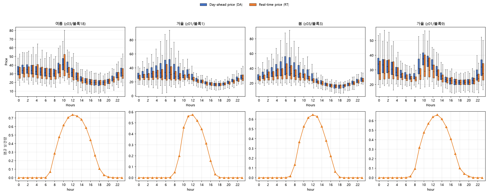

- **위 행(4칸)**: 논문 Fig.1과 같은 형식 — 시간대(0~23시)별 DA(파랑)·RT(주황) 가격을 **박스플롯**으로 그렸다. 박스는 25~75% 구간(사분위), 안쪽 선은 중앙값, 수염은 박스 경계에서 1.5×IQR까지다. 논문 Fig.1과 마찬가지로 범례를 그림 맨 위에 한 번만 뒀다.
- **아래 행(4칸)**: 같은 시간축에서 평균 태양광 발전량(주황) — 논문에는 없는, 가격과 발전 시점이 어떻게 맞물리는지 보려고 추가한 그래프다.

#### 4.2.2 시간대별 통계 요약

(발전시간대는 Sydney 현지시간 9~20시 고정 12시간이 기준이다)

| 계절(블록) | 24시간 전체 중 DA>RT | 발전시간대(9~20시)만 DA>RT | 발전시간대 평균(DA−RT) | 평균 DA가격 | 평균 RT가격 | 발전 피크 시각 |
|---|---:|---:|---:|---:|---:|---:|
| 여름 z03/18 | 14/24 (58%) | **10/12 (83%)** | +0.89 | 30.2 | 30.0 | 12시 |
| 겨울 z01/1 | 18/24 (75%) | **11/12 (92%)** | +1.28 | 28.2 | 27.6 | 12시 |
| 봄 z03/3 | 16/24 (67%) | **10/12 (83%)** | +1.30 | 29.0 | 28.4 | 12시 |
| 가을 z01/9 | 15/24 (62%) | **6/12 (50%)** | +0.11 | 28.3 | 28.0 | 13시 |

#### 4.2.3 논문 데이터셋의 개별 관측치·계절별 검증

논문의 Figure 1은 4개월 자료를 시간대별로 평균했을 때 하루의 모든 시간대에서 평균 DA 가격이 평균 RT 가격보다 높다는 것을 보여준다. 계절 별로 평균값을 비교하였을 때에도 여름(30.2>30.0)·겨울(28.2>27.6)·봄(29.0>28.4)·가을(28.3>28.0) 네 블록 모두 평균 DA가 평균 RT보다 높다.

개별 시간 관측치를 기준으로도 DA>RT가 얼마나 자주 성립하는지 추가로 확인해보니, 24시간 전체로 보면 본 연구의 네 대표 블록에서 DA>RT가 성립한 비율은 58~75%였고, RT>DA인 관측치는 주로 발전량이 없는 새벽·야간에 몰려 있었다.

발전시간대(9~20시) 관측치만 좁혀 보면, 계절마다 "논문의 평균 DA>RT 방향"이 개별 시점 단위에서도 얼마나 일관되게 유지되는지가 다르게 나타난다. 여름·봄은 DA>RT가 83%, 겨울은 92%로 발전시간대 대부분의 개별 시점에서도 방향이 유지되고 평균 격차도 뚜렷한 양수(+0.89~+1.30)다. 가을은 개별 관측치 기준 DA>RT가 50%로 나머지 세 블록보다 훨씬 낮지만, 평균 격차 자체는 +0.11로 여전히 양수다 — 즉 가을도 논문이 실제로 주장한 "평균 DA>평균 RT"는 그대로 성립하되, 그 평균을 이루는 개별 시간대 값들이 절반은 DA 우위·절반은 RT 우위로 팽팽하게 갈려 있어 평균 격차가 유독 작게 나온다.

가을이 다른 세 블록보다 개별 관측치 기준 DA>RT 비율·평균 격차 모두 약한 건, 겨울에 가까운 시기(11월 말~3월 말)라 발전시간대의 일사량 자체는 약하고 가격 변동폭도 상대적으로 좁기 때문으로 보인다 — 다만 평균으로 보면 방향(DA>RT) 자체는 다른 세 블록과 마찬가지로 유지된다.

또한 발전 피크와 가격 저점이 겹친 것을 확인할 수 있다. 네 블록 모두 DA/RT가 이중 봉우리(새벽·저녁 높고 낮 부근 저점) 모양인데, 태양광 발전은 정확히 그 저점 시간대(가을은 10~16시, 나머지는 10~14시)에 최고점을 찍는다. **발전량이 가장 많을 때 팔 수 있는 가격은 가장 낮다.** 이를 통해, 방법1(3항식)이 구조적으로 취약해지는 지점(DA−PC>0)에 발전량이 가장 많은 시점일수록 마진이 가장 얇아진다는 현실적 제약이 추가로 겹침을 확인하였다. 네 블록 모두 동일한 패턴을 보여, 계절과 무관하게 공통으로 나타나는 특징으로 판단된다.

정리하면, 발전시간대 기준 DA>RT 비율은 겨울·여름·봄이 83~92%로 뚜렷한 반면 가을은 50%까지 내려가 사실상 팽팽한 수준이므로, 개별 시간대 값의 변동 폭이 계절마다 다름을 알 수 있다.

---

## 5. 실험 및 개선 결과

방법별로 W1/W2 스윕(Fig.3/6 계열)과 벌금율 스윕(Fig.5/8 계열) 그래프를 논문값과 나란히 놓고 비교한 결과다. 

### 5.1 시도방법 1: 논문 공식

방법 1은 논문 Eq. 1a를 문자 그대로 3항으로 짠 것이다(PC=0.5×DA, 수식은 3.2.1절 참고). AR·MLR, W1/W2·벌금율 스윕 전 구간(Fig.3/5/6/8)에서 논문 곡선과 겹쳐 비교한 결과는 다음과 같다.

#### 5.1.1 모의실험 결과

- **Fig.3(AR, W1/W2 스윕)**: W1 비중이 커질수록 nRMSE가 36%(AR)에서 완만히 오르다 1/5 지점부터 116% 안팎으로 튀어 오른 뒤 그대로 고정된다. gap은 반대로 25%(AR)에서 시작해 1/5 지점부터 3.4%까지 뚝 떨어진 뒤 역시 고정된다.
- **Fig.5(AR, 벌금율 스윕, W1=W2=1)**: nRMSE는 0~90% 구간 내내 115~120% 안팎에서 오르내리다 100%에서야 68%로 급락한다. gap은 기본 AR(36%→8%, 선형 감소)과 제안 모형(2%→8%, 서서히 증가)이 반대 방향으로 움직이다 100% 지점에서 둘 다 8% 근처로 만난다.
- **Fig.6(MLR, W1/W2 스윕)**: nRMSE가 MLR(24%)에서 1/10 지점까지 완만히 오르다 이후 115% 안팎으로 튀어 고정된다. gap은 29% 안팎에서 시작해 1/10 지점부터 3~4% 선으로 떨어진 뒤 고정된다 — Fig.3과 같은 패턴이다.
- **Fig.8(MLR, 벌금율 스윕)**: nRMSE는 MLR 24% 고정, 제안 모형은 90%까지 115% 안팎에 머물다 100%에서 MLR 수준(약 28%)까지 크게 떨어진다. gap은 MLR이 41%→8% 안팎으로 거의 선형 감소하고, 제안 모형은 2%→8% 안팎으로 서서히 올라 끝에서 서로 만난다 — Fig.5와 방향이 반대인 대칭 모양이다.

_AR_MLR_baseline_proposed_3가지_profit_figure코드/fig3_ar_original.png)

_AR_MLR_baseline_proposed_3가지_profit_figure코드/fig5_ar_original.png)

_AR_MLR_baseline_proposed_3가지_profit_figure코드/fig6_mlr_original_v2.png)

_AR_MLR_baseline_proposed_3가지_profit_figure코드/fig8_mlr_original.png)

W1 비중이 커지면(z03 기준 5/1 이상) 116.45%/4.62%로 포화된다 — 이건 **방법1(PC=0.5×DA)의 구조적 한계**다. 3.2.1절에서 본 것처럼 PC=0.5·DA는 항상 DA보다 작아서 "약정을 늘릴수록 유리한" 구간이 모든 시간대에 남아있는데, W1 비중이 낮을 때는 W2(예측오차) 항이 이 유인을 눌러주다가 W1이 일정 임계값을 넘어서면 이 구조적 유인이 우세해지면서 다시 포화가 나타나는 것으로 보인다(방법4·5는 PC 정의를 바꿔 이 구간 자체를 줄이거나 없앤다 — 자세한 비교는 5.4·5.5절 참고).

### 5.2 시도방법 2: PC = RT + rate × DA

#### 5.2.1 모의실험 결과

**AR — Fig.3 (W1/W2 비율 스윕)**: 포화 없이 36%에서 68%까지 완만히 상승하고, gap은 15%에서 10.7%까지 완만히 하락한 뒤 평평해진다. 논문과 비교하면 초반엔 nRMSE가 논문보다 낮다가 후반부로 갈수록 논문보다 높게 벌어진다.

**AR — Fig.5 (벌금율 스윕, W1=W2=1)**: nRMSE는 0%에서 95%로 시작해 10%에 65%까지 급락한 뒤 60% 부근 53%까지 완만히 내려갔다가 다시 68%까지 오르는 U자형이다. 기본 AR은 벌금율과 무관하게 36%로 평평하다.

**MLR — Fig.6 (W1/W2 비율 스윕)**: nRMSE는 24%(MLR)~23%(1/20~1/10)에서 거의 안 움직이다 1/5부터 올라 1/0에서 53%에 도달한다. gap은 11%대에서 시작해 1/2 부근 10%로 최저점을 찍은 뒤 10.2~10.3%로 평평해진다.

**MLR — Fig.8 (벌금율 스윕, W1=W2=1)**: nRMSE는 0%에서 51%로 시작해 10%에 24%로 급락한 뒤 서서히 올라 100%에서 54%에 도달한다(저점이 초반에 있는 U자형). gap은 MLR이 14%→10%(30% 부근)→16%로 U자형을 그리고, 제안 모형은 13%→9.8~10%(30~40% 부근)→10.5%로 훨씬 좁은 범위에서 움직인다.

_AR_MLR_baseline_proposed_3가지_profit_figure코드/fig3_ar_profit_change.png)

_AR_MLR_baseline_proposed_3가지_profit_figure코드/fig5_ar_profit_change.png)

_AR_MLR_baseline_proposed_3가지_profit_figure코드/fig6_mlr_profit_change.png)

_AR_MLR_baseline_proposed_3가지_profit_figure코드/fig8_mlr_profit_change.png)

방법 2의 이익식(PC=RT+rate×DA)을 기준 W2=20의 몇 배까지 세게 줘야 논문에 가장 가까워지는지 찾아본 후속 실험은, 별도 방법(방법 8)으로 분리해 5.8절에서 다룬다.

### 5.3 시도방법 3: PC = c · RT 

방법 3은 Zhang 등(2024)의 아이디어를 빌려 남을 때 가격(RT)과 부족할 때 가격(c×RT, c>1)을 다르게 둔 것이다(수식은 3.2.3절 참고). c값은 아래와 같이 스윕해서 논문(Table 3, W1=1·W2=20 지점)과 가장 가까운 값을 찾았다.

| c | ρ₊ | 평가 |
|---:|---|---|
| 1.0 | RT | 비대칭 없음 — 방법 1과 비슷하게 무너짐 |
| 1.2 | 1.2·RT | 비대칭이 약해 무너짐이 덜 줄어듦 |
| **1.5** | **1.5·RT** | **논문과 가장 가까움 (AR nRMSE 35.68%, Gap 14.19%)** |
| 2.0 | 2.0·RT | 부족분 손해가 과해져 Gap이 다시 벌어짐 |
| 3.0 | 3.0·RT | 손해가 지나치게 커져 Gap 20~30%대로 악화 |

#### 5.3.1 모의실험 결과

- **Fig.3(AR, c=1.5, W1/W2 스윕)**: 포화 없이 36%에서 69%(2/1)까지 완만히 오른 뒤 5/1부터 평평해진다. gap은 14.5%에서 11%(1/1~5/1)까지 내려간 뒤 2/1에서 살짝 반등해 11~11.5%를 유지한다 — 방법2와 거의 같은 모양이다.
- **Fig.5(AR, c 스윕 1.0~2.0, W1=W2=1)**: nRMSE는 C=1.0(95%)에서 C=1.1(66%)로 급락한 뒤 57~66% 사이를 오르내린다(최저점 C=1.6~1.7, 57%). gap은 기본 AR이 13.4%→22%로 꾸준히 나빠지는 반면, 제안 모형은 14.2%에서 11%(C=1.4)로 내려간 뒤 11~12%에 머문다 — 기본 AR은 c가 커질수록 계속 악화되는데 제안 모형은 좁은 범위에 갇힌다.
- **Fig.6(MLR, c=1.5, W1/W2 스윕)**: nRMSE는 24%~23%(1/20~1/10)에서 거의 안 움직이다 1/5부터 올라 1/0에서 53%에 도달한다. gap은 11%대에서 시작해 1/1에서 10.3%로 최저점을 찍은 뒤 10.4% 선에서 평평해진다 — Fig.3과 같은 패턴이다.
- **Fig.8(MLR, c 스윕 1.0~2.0, W1=W2=1)**: nRMSE는 C=1.0(51%)에서 C=1.1(24%)로 급락해 MLR과 같아졌다가 c가 커질수록 다시 올라 C=2.0에서 54%에 도달한다. gap은 MLR이 14%→11%(C=1.3)→15.5%로 U자형을 그리고, 제안 모형은 12.8%→10.2%(C=1.5)→10.6%로 훨씬 좁은 범위에서 움직인다 — Fig.5와 대칭 모양이다.

_AR_MLR_baseline_proposed_3가지_profit_figure코드/fig3_ar_zhang_asym.png)

_AR_MLR_baseline_proposed_3가지_profit_figure코드/fig5_ar_zhang_asym.png)

_AR_MLR_baseline_proposed_3가지_profit_figure코드/fig6_mlr_zhang_asym.png)

_AR_MLR_baseline_proposed_3가지_profit_figure코드/fig8_mlr_zhang_asym.png)

### 5.4 시도방법 4: PC = rate × max(DA, RT)

방법 4는 벌금가를 PC=rate×max(DA,RT)로 정한 것이다(수식은 3.2.4절 참고). KPI 비교 기준점인 rate=50% 지점만 보면 (CVaR 제외) AR·MLR 둘 다 논문과 크게 벌어진다 — AR은 nRMSE +8.75%p·Gap +8.13%p(방법1과 함께 가장 큰 편차), MLR은 nRMSE +7.11%p·Gap +13.01%p(전체 중 Gap 편차가 가장 큼)로, 특히 MLR Gap 편차가 두드러진다(3.3절 KPI 표 참고).

#### 5.4.1 모의실험 결과

- **Fig.3(AR, W1/W2 스윕, rate=50% 고정)**: nRMSE는 36%에서 1/5 지점까지 완만히 오르다(1/10에서 77%) 이후 116% 안팎으로 튀어 고정된다. Gap은 25%에서 1/5 지점까지 급락해 4%에서 고정된다. 논문 곡선(35%→50%, 15%→11%)은 훨씬 완만해, 이쪽만 포화가 뚜렷하다.
- **Fig.5(AR, 벌금율 0~100% 스윕, W1=W2=1)**: 기본 AR은 36%로 평평하고, 제안 모형은 0~60%까지 116% 안팎에 머물다 70~80%에 120%까지 더 오른 뒤 90%(97%)·100%(68%)에서 급락한다 — KPI 기준점(rate=50%)이 하필 이 고원 한가운데라 가장 나쁘게 걸린다. Gap은 기본 AR이 36%→8%로 선형 감소하고, 제안 모형은 2%에서 90%(11%)까지 올랐다가 100%에서 8%로 내려온다 — 최적점은 rate≈0.9 부근이다.
- **Fig.6(MLR, W1/W2 스윕, rate=50% 고정)**: nRMSE는 24%에서 1/5 지점까지 오르다(1/10에서 51%) 이후 116% 안팎으로 튀어 고정된다. Gap은 28%에서 1/5 지점까지 급락해 5%에서 고정된다. 논문 곡선(22%→38%, 12%→9%)과는 1/5 지점부터 크게 벌어진다.
- **Fig.8(MLR, 벌금율 0~100% 스윕, W1=W2=1)**: 기본 MLR은 24%로 평평하고, 제안 모형은 0~80%까지 116% 안팎에 머물다 90%(65%)·100%(28%)에서 급락한다 — Fig.5(AR)와 같은 패턴이다. Gap은 기본 MLR이 41%→8%로 선형 감소하고, 제안 모형은 2%에서 90%(11%)까지 올랐다가 100%에서 8%로 내려온다.

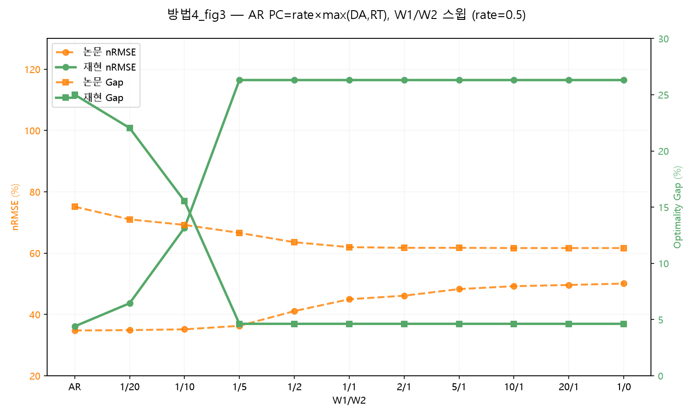

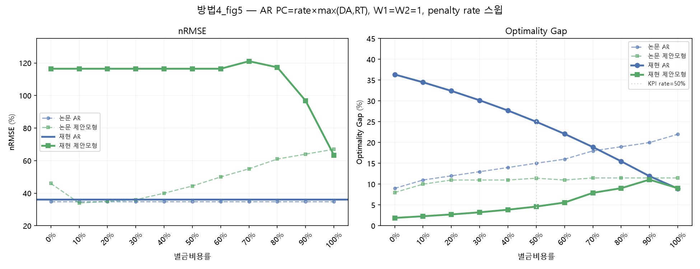

이건 방법 자체가 나쁘다기보다, 이 방법의 최적 rate(Fig.5·Fig.8의 90% 부근, ≈0.9)와 KPI 비교 기준점(rate=50%)이 멀리 떨어져 있어서다 — rate를 50%가 아니라 90% 근처로 잡았다면 다른 방법들과 비슷한 수준까지 좁혀졌을 것으로 보인다.

### 5.5 시도방법 5: PC = rate × (DA + RT)

방법 5는 벌금가를 PC=rate×(DA+RT)로 정한 것이다(수식은 3.2.5절 참고). rate를 0.1부터 1.0까지 바꿔가며 봤을 때 **rate=0.7** 근처가 논문과 가장 가까웠다 (W1/W2=1/20에서 nRMSE 35.59%, Gap 13.45%). rate=0.5(3.3절 표의 비교 지점)에서는 Gap이 10.70%로 논문(13.91%)보다 좀 작게 나온다 — 이 rate에서는 벌금이 살짝 약한 셈이다.

#### 5.5.1 모의실험 결과

- **Fig.3(AR, W1/W2 스윕)**: nRMSE는 36%에서 1/2(67%)까지 오르다 2/1 이후 100% 안팎에서 고정된다(방법4의 116%보다 낮고 늦게 포화). Gap은 11%에서 1/2부터 논문과 거의 겹친다(11~12%) — nRMSE만 논문보다 크게 벌어진다.
- **Fig.5(AR, 벌금율 스윕)**: 기본 AR은 36%로 평평, 제안 모형은 0~40%대 116~121%에 머물다 50%에 74%로 급락 후 54~68%에서 등락한다(방법4보다 이른 rate에서 회복). Gap은 기본 AR 36%→23% 선형 감소, 제안 모형은 50~60%(약 11%)에서 AR과 교차한다.
- **Fig.6(MLR, W1/W2 스윕)**: nRMSE는 24%에서 2/1(103%)로 급등, 5/1·10/1엔 24%로 돌아왔다가 20/1에 113%로 재급등한다. Gap도 같이 튄다.
- **Fig.8(MLR, 벌금율 스윕)**: 기본 MLR 24% 평평, 제안 모형은 0~40% 116%대에 머물다 50%(34%)·60%(24%, 최저)를 거쳐 100%까지 54%로 오른다(Fig.5와 동일 패턴). Gap은 기본 MLR 41%→16%, 제안 모형은 50~60%에서 교차 후 11% 선 유지.

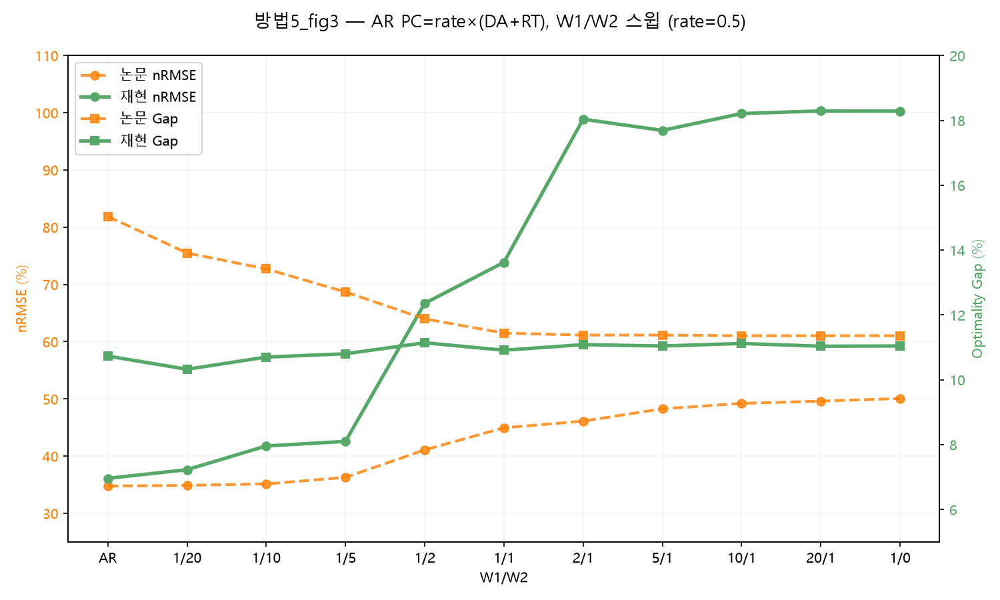

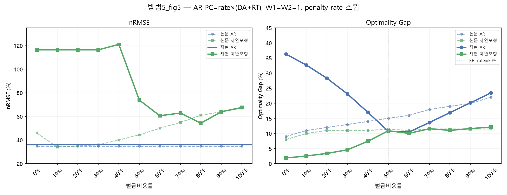

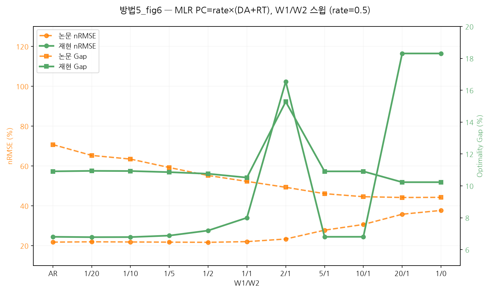

### 5.6 시도방법 6: PC = rate·DA·I[DA&gt;RT] + RT

방법 6은 shortage 비용에 RT를 무조건 포함시키고 벌금가(PC)에 DA>RT 조건부 가중치를 준 수정 이익식을 쓴다(수식·시행착오는 3.2.6절 참고).

#### 5.6.1 모의실험 결과

- **Fig.3(AR, W1/W2 스윕)**: nRMSE는 1/20~1/1 구간에서 논문과 1~4%p 정도의 차이를 보이지만, 2/1부터 49.5%에서 65~67%로 급격히 상승하여 논문의 46~50%대보다 높아진다. Gap은 1/20에서 논문보다 1.53%p 낮고, 1/1에서는 11.57%로 논문의 11.44%와 거의 일치한다. 2/1 이후에는 10~10.6%대에 머물러 논문의 11.36~11.38%보다 낮은 수준을 유지한다.
- **Fig.5(AR, 벌금율 스윕)**: nRMSE는 rate=0%에서 논문과 거의 일치하며, 이후에는 논문처럼 급격히 하락하지 않고 완만하게 움직이다가 높은 rate에서 48~53%대를 보인다. Gap은 rate=50%에서 11.57%로 논문의 11.44%와 거의 일치하고, rate=20~100%에서도 9.5~11.6%대로 논문의 9.9~11.5%와 유사한 범위를 유지한다. 다만 rate=0%에서는 13.5%로 논문의 약 8%보다 높게 나타난다.
- **Fig.6(MLR, W1/W2 스윕)**: nRMSE는 전 구간에서 논문보다 약 1.4~5.5%p 높지만, W1의 비중이 커져도 포화되지 않고 비교적 안정적으로 증가한다. Gap은 저비율 구간인 1/20~1/2에서 논문보다 약 0.9~2.3%p 낮고, 5/1 부근에서는 논문과 거의 일치한다. 이후 10/1~1/0 구간에서는 논문보다 약 0.25~0.42%p 높게 나타난다.
- **Fig.8(MLR, 벌금율 스윕)**: nRMSE는 rate=30~40%에서 최저점을 갖는 U자형으로 나타나 논문과 유사한 형태를 보이지만, 절대 수준은 논문보다 약 1~4%p 높다. Gap은 rate=0~10%에서 논문보다 2.9~6.1%p 높지만, rate=20% 이후에는 9.2~10.4%대를 유지하여 논문의 9.2~10.9%와 가까운 수준을 보인다.

![방법6 Fig.3(evaluation 정정) — AR, PC=rate×DA·I[DA>RT]+RT, W1/W2 스윕 (rate=50%)](results/방법6_fig3_ar_z03_block18_evaluation수정.png)

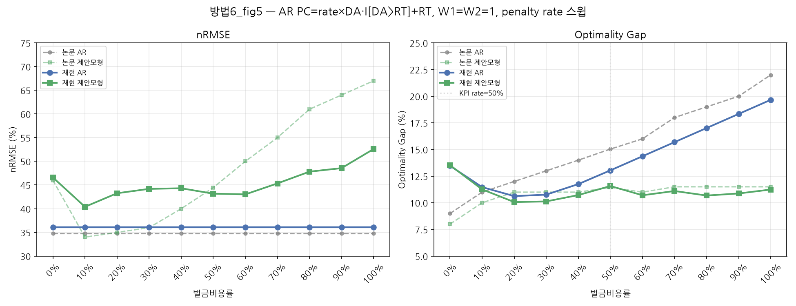

![방법6 Fig.6(evaluation 정정) — MLR, PC=rate×DA·I[DA>RT]+RT, W1/W2 스윕 (rate=50%)](results/방법6_fig6_mlr_z03_block18_evaluation수정.png)

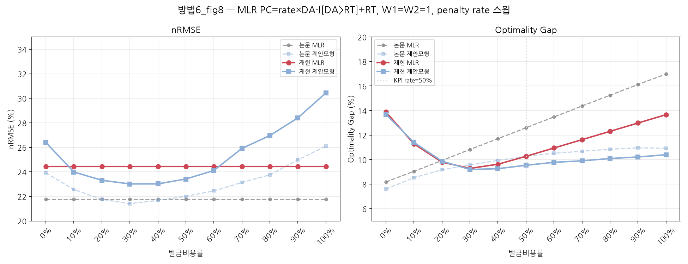

---
### 5.7 시도방법 7: Additive CVaR

방법 7은 기존 Proposed 모형에서 전체 economic regret을 줄이는 목적은 유지하면서, regret이 큰 상위 10% 구간을 추가로 관리한 확장이다(수식은 3.2.7절 참고). CVaR의 순수한 추가 효과를 보기 위해 동일한 Proposed 모형에서 \(\lambda=0\)과 \(\lambda=0.05\)를 비교하였다.

이 절은 도입 배경(5.7.1) → 목적함수 수정 과정(5.7.2) → 대표 블록 λ 선택(5.7.3) → AR·MLR·수익식별 비교(5.7.4) → 72개 블록 일반화 검증(5.7.5) → 최종 figure(5.7.6) 순으로 정리한다.

#### 5.7.1 CVaR 도입 전 진단

z03 블록 18의 시간대별 결과를 확인한 결과, 전체 nRMSE와 optimality gap이 개선되어도 일부 시간대에서는 economic regret이 악화되었다. 특히 11시에는 세 수익식 모두에서 Proposed AR의 시간대별 gap이 Baseline AR보다 커졌으며, CVaR90의 악화폭은 mean regret의 악화폭보다 훨씬 컸다.

| 수익식 | Mean regret 변화 | CVaR90 변화 |
|---|---:|---:|
| 방법1 | +22.7 | +63.2 |
| 방법2 | +26.8 | +121.9 |
| 방법3 | +34.3 | +206.0 |

또한 방법1의 15시와 16시에는 mean regret이 각각 7.01과 6.16 감소했지만 CVaR90은 49.77과 26.75 증가하였다. 즉 일반적인 시점의 손실은 줄었지만 최악의 일부 시점에서는 손실이 더 커질 수 있었다. 문제가 나타나는 시간대도 데이터 블록마다 달랐기 때문에 특정 시간대를 직접 보정하지 않고, 큰 regret이 발생한 시점을 자동으로 관리하는 CVaR를 적용하였다.

#### 5.7.2 초기 가중평균 방식과 수정

처음에는 기존 total regret과 CVaR를 다음과 같이 가중평균하였다.

$$
\min\;
W_2\sum_t|S_t-x_t|
+
W_1\left[
(1-\lambda)\sum_t r_t
+
\lambda N\operatorname{CVaR}_{\alpha}(r)
\right]
$$

그러나 이 방식은 \(\lambda\)가 증가할수록 CVaR 비중이 커지는 동시에 기존 total regret의 계수 \(1-\lambda\)가 감소한다. 대표 블록에서 \(\lambda=0.05\)를 적용했을 때 CVaR90은 0.75% 감소했지만 total regret은 2.94% 증가하고 nRMSE는 8.37%p 악화되었다.

본 실험에서는 최악의 일부 손실만 줄이는 것보다 전체 total regret을 줄이는 것을 우선적인 경제적 목표로 두었으므로 초기 방식은 폐기하였다. 이후 total regret의 계수를 유지하고 CVaR만 추가하는 Additive 방식으로 수정하였다.

$$
\min\;
W_2\sum_{t=1}^N|S_t-x_t|
+
W_1\left[
\sum_{t=1}^N r_t
+
\lambda N\operatorname{CVaR}_{\alpha}(r)
\right]
$$

CVaR의 선형화식(3.2.7절 형태, \(u_t\ge r_t-\zeta,\ u_t\ge 0\))을 대입하면 코드에 실제로 들어가는 목적함수가 된다.

$$
\min\;
W_2\sum_{t=1}^N|S_t-x_t|
+
W_1\sum_{t=1}^N r_t
+
W_1\lambda\left[N\zeta+\frac{1}{1-\alpha}\sum_{t=1}^N u_t\right]
$$

초기 방식과의 차이는 total regret 항의 계수다 — 초기 방식은 \((1-\lambda)\sum r_t\)라 \(\lambda\)가 커질수록 total regret 항 자체가 약해지지만, 이 최종 식은 \(\sum r_t\)를 그대로 두고 CVaR 항 \(W_1\lambda[N\zeta+\sum u_t/(1-\alpha)]\)만 얹는다. 그래서 \(\lambda=0\)이면 CVaR 항이 정확히 0이 되어 목적함수가 기존 APEN 구조 \(W_2\sum|S_t-x_t|+W_1\sum r_t\)로 그대로 돌아간다.

#### 5.7.3 대표 블록의 \(\lambda\) 선택

z03 블록 18의 Proposed AR·방법2 수익식에서 \(\lambda\)를 변화시킨 결과는 다음과 같다. 변화량은 모두 \(\lambda=0\) 대비 값이다.

| \(\lambda\) | nRMSE 변화 | Gap 변화 | Total regret 변화 | CVaR90 변화 | Maximum regret 변화 |
|---:|---:|---:|---:|---:|---:|
| 0.025 | −0.79%p | −0.55%p | −3.80% | −3.37% | −3.75% |
| **0.05** | **−1.19%p** | **−1.50%p** | **−10.41%** | **−10.06%** | **−15.47%** |
| 0.075 | +0.82%p | −1.37%p | −9.53% | −9.69% | −12.88% |
| 0.10 | +3.47%p | −1.37%p | −9.53% | −11.28% | −12.18% |

검토한 값 중 \(\lambda=0.05\)에서 nRMSE, total regret과 꼬리손실 지표가 함께 개선되어 이후 비교의 대표값으로 사용하였다. 다만 이 값은 z03 블록 18의 Proposed AR·방법2에서 선택한 비교값이며, 모든 데이터와 모형에 공통으로 적용되는 최적값은 아니다.

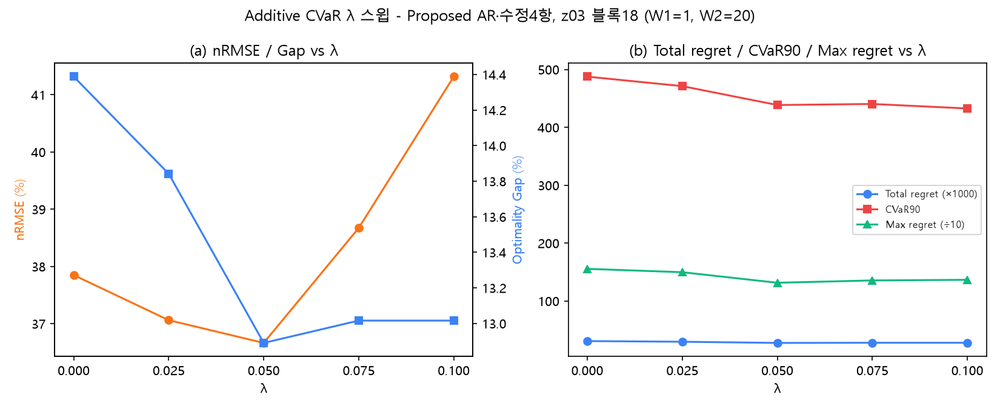

(a)는 λ가 커질수록 nRMSE와 Gap이 어떻게 움직이는지, (b)는 Total regret·CVaR90·Maximum regret(단위가 서로 달라 그래프에서는 배율을 조정해 표시했다 — 범례 참고)이 어떻게 움직이는지를 보여준다. λ=0.05까지는 다섯 지표가 대체로 함께 개선되다가, λ=0.075부터 nRMSE가 반등하면서 λ=0.05가 그림에서도 균형점으로 보인다.

#### 5.7.4 AR·MLR 및 수익식별 비교

**공통 조건**: z03 블록18(학습 90일/테스트 30일), W1=1, W2=20, penalty rate=50%(Zhang은 c=1.5), α=0.9, Additive CVaR, λ=0(미적용) vs λ=0.05.

| 모형·수익식 | nRMSE (λ=0→0.05) | Gap (λ=0→0.05) | Total regret 변화 | CVaR90 변화 | Max regret 변화 |
|---|---:|---:|---:|---:|---:|
| AR·방법1 | 42.29%→41.45% | 23.51%→24.04% | +2.26% | −0.42% | −2.90% |
| AR·방법2 | 37.85%→36.66% | 14.39%→12.89% | **−10.41%** | **−10.06%** | **−15.47%** |
| AR·방법3 | 37.88%→39.75% | 13.82%→13.33% | −3.51% | −7.42% | −14.91% |
| MLR·방법1 | 31.34%→32.41% | 24.53%→24.29% | −1.00% | −0.51% | −0.87% |
| MLR·방법2 | 23.20%→23.03% | 10.89%→10.82% | **−0.65%** | **−1.78%** | **−4.25%** |
| MLR·방법3 | 23.21%→23.01% | 10.86%→10.84% | **−0.23%** | **−2.34%** | **−6.91%** |

(굵게: 5개 지표 전부 λ=0 대비 개선)

6개 조합 중 AR·방법2, MLR·방법2, MLR·방법3 세 조합은 5개 지표가 λ=0 대비 전부 개선됐다. 나머지 세 조합은 지표가 갈린다 — AR·방법1은 CVaR90·Max regret은 줄지만 Gap·Total regret이 늘고, AR·방법3은 경제 지표(Total regret·CVaR90·Max regret)는 줄지만 nRMSE가 늘고, MLR·방법1은 nRMSE·Gap이 함께 늘면서 경제 지표만 준다. 전반적으로 방법2이 AR·MLR 양쪽에서 가장 안정적으로 개선되는 조합이었다.

#### 5.7.5 72개 블록 검증

대표 블록(zone 3 블록 18)의 결과가 다른 기간에도 유지되는지 확인하기 위해 Proposed AR·방법2(W1=1, W2=20, penalty rate=50%, α=0.9, λ=0 vs 0.05)을 Zone 1·2·3, 각 Zone당 24개씩 총 72개 블록(블록당 학습 90일/테스트 30일)에 적용하였다.

**아래 표의 수치는 72개 블록의 테스트표본(각 30일×12시간=360개, 총 72×360=25,920개 시점)을 전부 하나로 합쳐 계산한 "pooled(통합)" 지표다.** Total regret은 25,920개 시점의 economic regret을 전부 더한 합계이고, Pooled optimality gap·Pooled nRMSE도 (전체 regret 합)/(전체 oracle profit 합), (전체 RMSE)/(전체 평균발전량) 식으로 전체 시점을 한 번에 계산한 값이다 — 72개 블록별로 따로 계산한 gap 72개를 단순 평균한 것이 아니다. Maximum regret은 25,920개 시점 중 가장 큰 단일 regret 값이고, Pooled CVaR90은 이 25,920개 중 regret이 큰 상위 10%(2,592개)의 평균이다.

| 지표 | \(\lambda=0\) | \(\lambda=0.05\) | 변화 |
|---|---:|---:|---:|
| Total regret (25,920개 시점 합계) | 2,185,796 | 2,168,231 | −0.80% |
| Pooled optimality gap | 21.09% | 20.92% | −0.17%p |
| Pooled CVaR90 (상위 10%, 2,592개 평균) | 551.59 | 545.90 | −1.03% |
| Maximum regret (25,920개 중 최댓값) | 22,671.76 | 21,990.32 | −3.01% |
| Pooled nRMSE | 67.28% | 68.75% | **+1.47%p** |

이 pooled 지표와는 별도로, 72개 블록 각각에서 λ=0.05가 λ=0보다 개선됐는지를 블록 단위로도 세었다: **Total regret 개선 51/72개, CVaR90 개선 53/72개, nRMSE 개선 16/72개, optimality gap과 nRMSE가 동시에 개선된 블록은 14/72개**였다. 즉 pooled 지표 하나가 개선됐다고 해서 대부분의 블록에서 개선됐다는 뜻은 아니고(예: nRMSE는 pooled로는 악화됐지만 개별 블록 중 16개에서는 오히려 개선됐다), pooled 지표는 "전체 시점을 하나의 큰 테스트셋으로 봤을 때"의 요약값으로 해석해야 한다.

Zone별로 나누면 다음과 같다(각 Zone 24개 블록, pooled optimality gap 기준).

| Zone | Total regret 개선 블록 | λ=0 pooled Gap | λ=0.05 pooled Gap | Total regret 변화 |
|---|---:|---:|---:|---:|
| Z01 | 16/24 | 21.11% | 20.84% | −1.28% |
| Z02 | 18/24 | 20.81% | 20.91% | +0.52% |
| Z03 | 17/24 | 21.34% | 21.00% | −1.57% |
| 전체 | 51/72 | 21.09% | 20.92% | −0.80% |

Z02는 24개 블록 중 18개(75%)에서 개별적으로 total regret이 줄었는데도 Zone 전체 합계는 오히려 0.52% 늘었다 — 소수 블록에서 벌어진 큰 악화가 다수 블록의 소폭 개선을 상쇄했기 때문이다.

특히 Z02 블록 4에서는 total regret이 55.13%, CVaR90이 92.90% 증가하였다(optimality gap 17.60%→27.30%). 2012-10-08 10시 한 시점에서 CVaR 적용 모형이 약정량을 설비 상한(x=1)으로 올렸는데, 실제 발전량은 0.30에 그치고 real-time 가격이 급등(169.06)해 이 한 시점에서만 4,445.83의 regret이 발생했다(λ=0에서는 이 시점 regret이 0이었다). 이는 학습자료에서 CVaR를 줄였더라도 테스트기간의 가격·발전량 분포가 달라지면 더 큰 손실이 발생할 수 있음을 보여준다. 이 블록을 제외하면 Z02 나머지 23개 블록의 total regret은 약 1.34% 감소, 전체 71개 블록 기준으로는 약 1.40% 감소로 바뀐다 — 즉 pooled 결과의 상당 부분이 이 한 블록의 극단값에 좌우된다.

#### 5.7.6 모의시험 결과

z03 블록18에서 방법1·방법2·방법3 세 수익식 × AR/MLR에 대해 CVaR 적용 전(λ=0)·후(λ=0.05)를 겹쳐 그린 W1/W2 스윕(Fig.3/6)·penalty rate·C 스윕(Fig.5/8) 12장을 분석한 결과다.

- **방법1(Fig.3/5/6/8)**: AR·MLR 모두 W1/W2·penalty rate 스윕 전 구간에서 λ=0과 0.05 곡선이 거의 완전히 겹친다 — 이미 구조적 붕괴(포화)가 일어난 지점이라 CVaR를 더해도 해가 바뀌지 않는다.
- **방법2(Fig.3/5/6/8)**: W1/W2·penalty rate가 커질수록(경제적 항 비중 증가) CVaR 적용 후 nRMSE가 적용 전보다 눈에 띄게 높아지지만, 같은 구간에서 Gap 곡선은 거의 겹친다.
- **방법3(Fig.3/5/6/8)**: 방법2와 같은 패턴 — c가 커질수록 nRMSE는 CVaR 적용 후가 더 높아지지만 Gap 곡선은 거의 붙어있다.

**AR — W1/W2 스윕(Fig.3)과 penalty rate·C 스윕(Fig.5):**

_수정된_CVaR_시간별지표_figure코드/fig3_ar_cvar_compare.png)

_수정된_CVaR_시간별지표_figure코드/fig5_ar_cvar_compare.png)

_수정된_CVaR_시간별지표_figure코드/fig3_ar_profit_change_cvar_compare.png)

_수정된_CVaR_시간별지표_figure코드/fig5_ar_profit_change_cvar_compare.png)

_수정된_CVaR_시간별지표_figure코드/fig3_ar_zhang_asym_cvar_compare.png)

_수정된_CVaR_시간별지표_figure코드/fig5_ar_zhang_asym_cvar_compare.png)

**MLR — W1/W2 스윕(Fig.6)과 penalty rate·C 스윕(Fig.8):**

_수정된_CVaR_시간별지표_figure코드/fig6_mlr_cvar_compare.png)

_수정된_CVaR_시간별지표_figure코드/fig8_mlr_cvar_compare.png)

_수정된_CVaR_시간별지표_figure코드/fig6_mlr_profit_change_cvar_compare.png)

_수정된_CVaR_시간별지표_figure코드/fig8_mlr_profit_change_cvar_compare.png)

_수정된_CVaR_시간별지표_figure코드/fig6_mlr_zhang_asym_cvar_compare.png)

_수정된_CVaR_시간별지표_figure코드/fig8_mlr_zhang_asym_cvar_compare.png)

 **방법1**은 W1/W2·penalty rate 어디를 봐도 CVaR 적용 전후 곡선이 거의 완전히 겹친다 — 방법1의 구조적 붕괴(포화)가 이미 일어난 지점에서는 CVaR를 더해도 해가 바뀌지 않기 때문이다. **방법2·방법3**은 W1/W2나 penalty rate·C가 커질수록(=경제적 항의 비중이 커질수록) CVaR 적용 후(빨강/진한 색) nRMSE가 적용 전(주황)보다 눈에 띄게 높아지는 반면, 같은 구간에서 Optimality Gap 곡선(파랑 vs 초록)은 서로 가깝게 붙어 있다. CVaR를 세게 걸수록 예측정확도는 확실히 나빠지는데, 그 대가로 얻는 경제적 개선은 제한적이다.

### 5.8 시도방법 8: 방법 2의 기준 W2 배수 탐색

방법 8의 이익식은 방법 2(5.2절)와 완전히 같다(PC=RT+rate×DA). 다른 점은  W1/W2 지점이다 — 방법 2는 논문 비교 기준점(W1=1, W2=20)에 그대로 대입해서 평가하지만, 방법 8은 기준 W2=20에서 시작해 그 몇 배까지 세게 줘야 논문 결과에 가장 가까워지는가를 배수 1배~15배까지 스윕해서 찾아 본 것이다(3.2.8절).

#### 5.8.1 W2 배수 스윕

**왜 배수를 찾기로 했는지**: 방법 2·8이 쓰는 원본 Gurobi 코드는 목적함수를 scale·denom·n_obs로 정규화하지 않고 raw 계수를 그대로 쓴다(obj\_x=−W1·DA, sc=−W1·RT+W2, yc=W1·PC+W2). 여기서 DA·RT·PC에 곱해지는 값은 설비용량 대비 0~1 스케일의 발전량 비율인데, DA·RT·PC 자체는 실제 가격(≈20~80원대)이라서 W1=W2=1이어도 economic 항의 원래 크기가 예측오차 항(0~1 스케일 그대로 쓰이는 |S−x|)보다 훨씬 크다. 그 결과 economic 항이 예측오차 항을 사실상 지배해버려 nRMSE가 59~73%까지 치솟았다. 그래서 정규화를 새로 도입하는 대신, W2에 배수를 곱해 W1과 비슷한 자릿수로 맞춰주는 쪽으로 방향을 잡았다:

$$W2_{\text{기준}} = 20, \qquad W2_{\text{적용}} = W2_{\text{기준}} \times k \qquad (k = \text{배수})$$
$$\text{obj}_{x_i} = -W1\cdot DA_i, \qquad sc_i = -W1\cdot RT_i + W2_{\text{적용}}, \qquad yc_i = W1\cdot PC_i + W2_{\text{적용}}$$

배수 $k$를 1배~15배까지 스윕하며 논문 Fig.5 판독값(rate 0/10/30/50/70/100%) 대비 SSE(nRMSE+Gap 오차 제곱합)를 비교한 결과:

| 배수(k) | 1 | 2 | 3 | **4** | 5 | 6 | 8 | 10 | 12 | 15 |
|---|---|---|---|---|---|---|---|---|---|---|
| SSE | 4511.5 | 980.1 | 411.2 | **395.8** | 456.1 | 596.7 | 1009.8 | 1092.9 | 1149.7 | 1233.1 |

**4배(W2=80)가 최적**으로 확정됐다. 4배에서 rate=0/10/30/50/70/100%의 nRMSE는 46.60/43.42/45.65/44.64/48.97/55.03%(논문 46/34/36/44.45/55/67%)로, rate=0%·50%에서 논문과 거의 정확히 일치(±0.6%p)하고 Gap도 15배일 때(5.6%→16%, 너무 가파름)보다 훨씬 평평해져 논문의 결과에 가까워졌다.

#### 5.8.2 KPI 재검증

**KPI 기준점(W1=1, W2=20의 4배, rate=50%) 및 그리드 재검증**

| W1/W2 | 재현 nRMSE | 논문 nRMSE | 재현 Gap | 논문 Gap | 비고 |
|---|---:|---:|---:|---:|---|
| baseline | 36.11% | 34.76% | 14.94% | 15.04% | ±0.1%p 일치 |
| 1/20의4배 | 36.32% | 34.89% | 14.55% | 13.91% | KPI 지점 (3.3절) |
| 1/10의4배 | 36.67% | 35.14% | 14.58% | 13.42% | |
| 1/1의4배 | 44.64% | 44.95% | 11.79% | 11.44% | 거의 정확히 일치 |
| 20/1의4배 | 67.03% | 50.07% | 10.69% | 11.36% | 이 극단점만 크게 벗어남 |

1/20~1/1(×4배) 구간(Fig.3/5/8이 실제로 쓰는 범위)에서는 전부 논문과 근접하고, W2가 극단적으로 작은 20/1 지점만 어긋난다.

#### 5.8.3 모의시험 결과

- **Fig.3(AR, W1/W2 스윕)**: nRMSE는 1/1까지 논문과 나란히 오르다(44.6% vs 44.95%) 2/1부터 급격히 갈라져 1/0에서 67.8%(논문 50%)까지 치솟는다. Gap은 1/1까지 논문과 겹치며 14.9%→11.8%로 내려간 뒤 10.6~10.7%에서 평평하다.
- **Fig.5(AR, 벌금율 스윕)**: 제안 모형 nRMSE는 재현이 44~47%대를 오르내리다 60%부터 55~56%로 오르고, 논문은 10%에 34%까지 떨어졌다 100%에 66.7%까지 오른다 — rate=50%에서만 거의 같다(44.64% vs 44.45%). 기본 AR Gap은 둘 다 선형으로 오르고(13.5→23%, 9→21%), 제안 모형 Gap은 20%부터 11~12%에서 거의 겹친다.
- **Fig.6(MLR, W1/W2 스윕)**: nRMSE는 1/2까지 평평(재현 23~24%, 논문 22%)하다 1/1부터 갈라져 1/0에서 52.9%(논문 37.6%)까지 벌어진다. Gap은 1/1까지 내려간 뒤(10.2%/10.4%) 재현 10~10.3%, 논문 9.3~9.5%로 거의 겹친다.
- **Fig.8(MLR, 벌금율 스윕)**: 제안 모형 nRMSE는 둘 다 20~30%에서 최저점(23.0%/21.4%)을 찍는 U자형이지만 이후 재현이 훨씬 가파르게 올라 100%에 35.4%(논문 26.2%)까지 벌어진다. baseline Gap은 둘 다 U자형이다 논문이 더 가파르게 올라 100%에서 비슷해지고, 제안 모형 Gap은 30%대 이후 10~11%에서 평평하다.

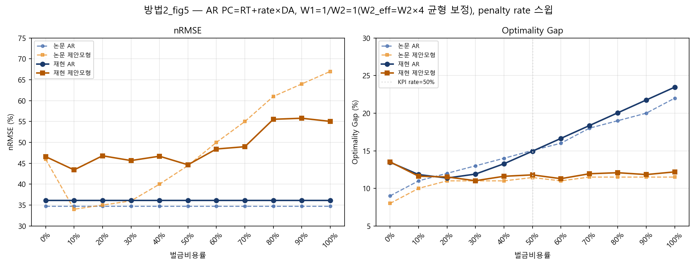

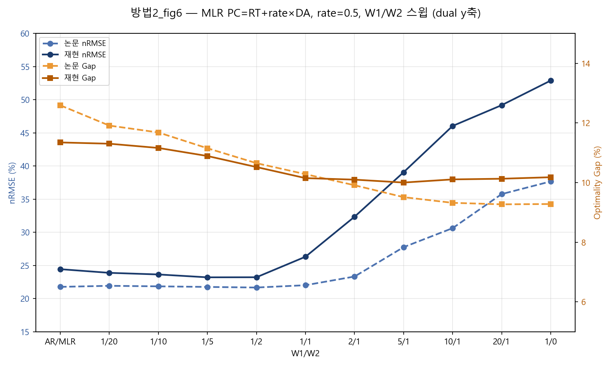

### 5.9 시험결과 정리

#### 5.9.1 종합 정리

원본 3항 profit function을 시도한 방법 1은 재현에 사실상 실패했다 — proposed model의 약정량이 상한에 붙어버리고, W1/W2·penalty rate가 조금만 바뀌어도 nRMSE와 optimality gap이 특정 값으로 급격히 튀거나 고정되는 구조적 붕괴가 나타났다. 논문 Figure의 완만한 trade-off는 전혀 재현되지 않았다.

방법 2~5는 이러한 현상이 shortage 비용의 정의에서 발생하는지 확인하기 위해 profit function을 변경한 추가 실험이다. 방법 2와 방법 3에서는 원본 3항식에서 나타난 포화 현상이 완화되고 논문과 비교적 유사한 곡선이 나타났다. 방법 4와 방법 5도 특정 penalty rate에서는 결과가 개선되었지만, 선택한 rate에 따라 결과가 크게 달라졌다. 따라서 이 방법들은 원본 재현 결과를 대체하는 최종 모형이 아니라, profit function의 정의가 결과에 미치는 영향을 확인한 비교 실험으로 해석하였다.

방법 6은 shortage 비용에 RT를 포함하고, (DA>RT)인 경우에만 추가 벌금을 적용한 이익식 변형이다. AR에서는 두 지표의 절대편차 합이 가장 작았고, MLR에서는 nRMSE가 논문보다 2.02%p 높았지만 optimality gap은 1.77%p 낮았다. AR·MLR 종합 논문 근접도는 4위였으나, optimality gap을 기준으로 한 경제적 성능은 비교적 우수했다.

방법 7(Additive CVaR)은 Proposed 모형의 꼬리손실(regret 상위 10%)을 추가로 관리하는 위험회피 확장이다. 대표 블록(z03/18, Proposed AR·방법2)에서는 λ=0.05 적용 시 total regret −10.41%, CVaR90 −10.06%, maximum regret −15.47%로 크게 개선됐고 nRMSE·Gap도 같이 좋아졌다 — 대표 블록만 보면 꽤 성공적이었다.

하지만 72개 블록으로 넓혀보면 얘기가 달라진다. pooled 지표는 total regret −0.80%, Gap −0.17%p, CVaR90 −1.03%, maximum regret −3.01%로 전부 소폭 개선됐지만, nRMSE는 오히려 +1.47%p 악화됐다. 블록 단위로 봐도 nRMSE·Gap이 동시에 개선된 블록은 72개 중 14개뿐이다. 대표 블록 하나에서 좋아 보였던 결과가 전체로 확장하니 사실상 효과가 거의 없는 수준이 되었다.

방법 8은 논문 KPI 지점에서 방법2(초기)보다 논문에 더 가깝다(Δ nRMSE 1.43%p vs 2.96%p). 다만 이 개선은 새로운 이익식이 아니라, 방법 2와 완전히 같은 이익식(PC=RT+rate×DA)을 W2=20의 4배 지점에서 평가한 결과다(5.8절) — 이익식 자체의 우수성이라기보다 비교 기준점을 옮긴 효과에 가깝다.

#### 5.9.2 Fig.3/5/6/8 곡선 형태 판정

방법별로 Fig.3(AR W1/W2)·Fig.5(AR rate)·Fig.6(MLR W1/W2)·Fig.8(MLR rate) 네 그래프가 논문과 같은 모양(포화 없이 완만한 트레이드오프)으로 나왔는지를 한눈에 정리하면:

| 방법 | Fig.3 | Fig.5 | Fig.6 | Fig.8 | 종합 판정 |
|---|---|---|---|---|---|
| 1 (논문 수식) | ❌ 특정 지점부터 포화·고정 | ❌ 90%대까지 무너짐 | ❌ 포화 | ❌ 포화 | **재현 실패** (구조적) |
| 2 (PC=RT+rate×DA, §5.2.1 초기) | ✅ 완만 | ✅ U자형이나 논문과 같은 방향 | ✅ 완만 | ✅ 완만 | **재현 성공** |
| 3 (방법3, c=1.5) | ✅ 완만 | ✅ C=1.5 최적, 기본/제안 gap 뚜렷이 갈라짐 | ✅ 완만 | ✅ 완만 | **재현 성공** |
| 4 (PC=max(DA,RT)) | △ rate 낮으면 포화 | △ rate=0.9이어야 최적, rate=0.5는 이탈 큼 | △ rate 의존 | △ rate 의존 | **부분 재현** (rate 의존적) |
| 5 (PC=DA+RT) | △ 2/1부터 100% 안팎에서 포화(방법4보다 늦고 낮음) | △ rate=0.7이어야 최적 | △ 2/1~20/1 급등락(5/1·10/1은 HiGHS infeasible 대체값 추정, 해석 주의) | △ 동일 | **부분 재현** (rate 의존적) |
| 6 (PC=rate×DA·I[DA>RT]+RT) | △ 1/20~1/1에서는 비교적 근접하나, 2/1 이후 nRMSE가 논문보다 높게 벌어짐 | △ Gap은 rate=20~100%에서 근접하지만, nRMSE 변화는 논문보다 완만함 | ✅ 포화 없이 안정적으로 변화하며, Gap은 5/1 부근에서 거의 일치 | ✅ nRMSE의 U자형이 유사하고 rate≥20%에서 Gap도 근접하나, 저rate에서는 차이가 큼 | 재현 성공 (전반적으로 완만한 곡선을 보이나 일부 고-W1·저rate 구간에서 차이) |
| 7 (Additive CVaR) | ❌원본3항(적용 전후 완전히 겹침=CVaR 무효과) / △수정4항·방법3(W1/W2 커질수록 nRMSE 벌어짐) | ❌원본3항 / △수정4항·방법3(penalty·C 커질수록 nRMSE 벌어짐) | ❌원본3항 / △수정4항·방법3 | ❌원본3항 / △수정4항·방법3 | **제한적 개선** (경제항 비중이 커지는 구간에서 nRMSE 손실이 Gap 개선보다 큼 — 그림은 5.7절 CVaR 그림 참고) |
| 8 (PC=RT+rate×DA, W2=20의 4배) | ✅ 완만하나 2/1부터 벌어짐(1/0에서 67.8% vs 논문 50%) | △ Gap은 논문과 거의 겹치나 nRMSE는 rate 양끝에서 크게 벌어짐(rate=50%에서만 근접) | ✅ 완만하나 1/0에서 벌어짐(52.9% vs 논문 37.6%) | ✅ 완만 | **재현 성공** |

#### 5.9.3 논문 재현도 종합 비교

3.3절의 KPI 지점에서 논문 대비 절대편차를 다음과 같이 계산하여 방법별 재현도를 비교하였다.

$$
D_{\mathrm{AR}}
=
|\Delta nRMSE_{\mathrm{AR}}|
+
|\Delta Gap_{\mathrm{AR}}|,
\qquad
D_{\mathrm{MLR}}
=
|\Delta nRMSE_{\mathrm{MLR}}|
+
|\Delta Gap_{\mathrm{MLR}}|
$$

최종 재현도 점수는 두 모형의 편차를 합한 \(D_{\mathrm{AR}}+D_{\mathrm{MLR}}\)이며, 값이 작을수록 논문의 KPI와 가깝다는 뜻이다. 방법 1~7은 \(W_1=1,\ W_2=20\)을 사용했으며, 방법 8은 해당 방법의 정의에 따라 \(W_2=80\)을 사용하였다.

다만 이 순위는 각 방법의 성능 우열이 아니라 논문 결과와의 유사성을 비교한 것이다. nRMSE는 방법 간 직접 비교가 가능하지만, optimality gap은 수익식에 따라 oracle profit과 realized profit의 정의가 달라지므로 서로 다른 수익식을 사용한 방법들의 경제적 성능을 직접 비교하는 지표로 보기 어렵다.

| 순위 | 방법                                           | AR 편차 \(D_{\mathrm{AR}}\) | MLR 편차 \(D_{\mathrm{MLR}}\) |         총편차 | 해석                                         |
| -: | -------------------------------------------- | ------------------------: | --------------------------: | ----------: | ------------------------------------------ |
| 1위 | 방법 8 — \(PC=RT+rate\times DA,\ W_2=80\)      |                    2.07%p |                      2.57%p |  **4.64%p** | 논문 KPI에 가장 가까움. 다만 \(W_2\) 배수 탐색으로 선택된 결과임 |
| 2위 | 방법 7 — Additive CVaR, 방법 2 수익식               |                    2.79%p |                      2.20%p |  **4.99%p** | AR·MLR 모두 비교적 작은 편차를 보임                    |
| 3위 | 방법 3 — \(PC=c\times RT,\ c=1.5\)             |                    3.08%p |                      2.34%p |  **5.42%p** | AR과 MLR에서 고르게 논문과 근접함                      |
| 4위 | 방법 6 — \(PC=RT+rate\times DA\cdot I[DA>RT]\) |                    1.65%p |                      3.79%p |  **5.44%p** | AR 편차는 가장 작지만 MLR 편차가 상대적으로 큼              |
| 5위 | 방법 2 — \(PC=RT+rate\times DA\)               |                    3.44%p |                      2.30%p |  **5.74%p** | 두 모형에서 비교적 균형 있게 근접함                       |
| 6위 | 방법 5 — \(PC=rate\times(DA+RT)\)              |                    6.32%p |                      3.30%p |  **9.62%p** | 특히 AR Gap이 논문보다 낮아 절대편차가 커짐                |
| 7위 | 방법 4 — \(PC=rate\times\max(DA,RT)\)          |                   16.88%p |                     20.12%p | **37.00%p** | 기준 rate=50%에서 두 모형 모두 논문과 큰 차이를 보임         |
| 8위 | 방법 1 — \(PC=rate\times DA\)                  |                   17.00%p |                     22.04%p | **39.04%p** | 두 모형 모두 논문과 가장 큰 차이를 보임                    |

방법 8의 총편차가 가장 작아 논문 KPI와 가장 가까웠고, 방법 7이 그다음으로 나타났다. 방법 3과 방법 6의 총편차는 각각 5.42%p와 5.44%p로 차이가 0.02%p에 불과하므로 사실상 유사한 수준으로 볼 수 있다. 방법 6은 AR에서 가장 높은 재현도를 보였지만 MLR의 편차가 상대적으로 컸으며, 방법 2는 두 모형에서 비교적 균형 있는 결과를 보였다.

이 순위는 논문값과의 근접도만 나타낸다. 특히 논문보다 낮은 optimality gap도 절대편차 계산에서는 불일치로 처리되므로, 순위가 낮다고 해서 해당 방법의 예측 또는 경제적 성능이 반드시 낮다는 의미는 아니다. 가중치와 벌금률 변화에 따른 곡선 형태는 5.9.2절에서 별도로 비교하였다.

---

## 6. 결론

논문 수식을 그대로 쓰면(방법1) 이번 데이터·구현에서는 재현되지 않았다. 약정량이 상한에 붙고 nRMSE·Gap이 특정 파라미터에서 급변하는 걸 보면, 이건 튜닝을 더 해서 고칠 문제가 아니라 이 수식 자체가 갖고 있는 구조적 한계로 보인다.

방법 2~6은 shortage 비용의 정의를 바꾸어 원본 수익식에서 나타난 과다약정 문제를 완화하려는 접근이다. 방법 2·3·6에서는 급격한 포화가 줄고 비교적 완만한 곡선이 나타난 반면, 방법 4·5는 penalty rate에 따라 결과가 크게 달라졌다. 방법 6은 AR에서 논문과 가장 가까운 KPI를 보였지만, AR과 MLR을 합산한 종합 재현도에서는 방법 3과 유사한 수준이었다. 이를 통해 특정 방법의 절대적인 우위보다는 shortage 비용의 정의가 모형의 결과에 큰 영향을 준다는 점을 확인하였다.

CVaR(방법7)은 대표 블록에서만 보면 성공적이었지만, 72개 블록으로 넓히니 효과가 거의 사라졌다. 대표 사례 하나로 일반화를 주장하기엔 위험하다는 걸 보여주는 사례라, 이번 결과만 놓고 CVaR를 적극 추천하긴 어렵다고 판단했다.

방법 8은 방법 2와 이익식이 같고 W2 배수만 다른데도 논문에 더 가까워졌다 — 다만 이건 새 방법을 찾은 게 아니라 비교 기준점을 옮긴 효과라, "성능이 좋아졌다"기보다는 "어디서 비교하느냐가 이만큼 결과를 바꾼다"는 걸 보여주는 사례이다.

종합하면, 이번 재현에서는 이익식의 정의와 가중치 설정이 결과에 큰 영향을 미쳤다. 방법1에서는 급격한 포화가 나타난 반면, shortage 비용을 다르게 반영한 방법들은 비교적 완만한 곡선을 보였으며, 방법 8은 논문의 KPI와 가장 가까운 결과를 나타냈다. 다만 수익식에 따라 optimality gap의 산정 기준도 달라지므로, 방법 간 절대적인 성능보다 논문 결과와의 유사성과 모형의 거동을 중심으로 비교하였다. 또한 대표 결과가 z03 블록18에 크게 의존하므로, 다른 데이터에서도 같은 경향이 유지되는지는 추가로 확인할 필요가 있다

---

## 7. 느낀점

논문의 실험 결과를 구현하는 것이 생각보다 훨씬 어려웠다. 코딩 실력이 부족해도 수식(Eq. 9a, Eq. 13)에 충실하면 어느정도 결과가 나올 줄 알았는데, 실제로 돌려보니 계수가 한쪽으로 완전히 쏠려버려서 한참을 헤맸다. 원인을 찾아가다 보니 W1/W2 스케일을 어떻게 맞출지, 오라클을 몇 개로 볼지, 부족분 비용을 어떻게 계산할지처럼 한 줄짜리 수식 뒤에는 우리가 직접 판단해서 채워야 하는 부분이 생각보다 많았다. 논문을 재현한다는 게 수식을 그대로 옮기는 게 아니라, 적혀 있지 않은 디테일을 채워나가는 과정이라는 걸 이번에 느꼈다.

여러 방법을 하나씩 시도하면서, 그 판단 하나하나가 결과를 얼마나 크게 바꾸는지 체감했다. PC 재정의(방법2)나 방법3 방식처럼 이익식 자체를 고쳐야 풀리는 문제였다는 걸 알기까지 여러 번 돌아갔는데, 돌아갈 때마다 원인을 하나씩 좁혀나가는 과정 자체가 재밌기도 하고 답답하기도 했다. 결과적으로 이익식을 고쳐서 논문에 가까워지는 걸 봤을 때는 그동안의 시행착오가 헛되지 않았다는 느낌이 들었다.

---

## 첨부: PC = RT + rate×DA 유추 근거

### 근거 1 — 실제 전력시장의 정산 구조 (미국 ISO 사례)

> 미국 ISO(MISO·PJM·ERCOT·ISO-NE 등)의 two-settlement system: 하루전시장 스케줄과 실제 발전량의 차이를 실시간시장에서 정산한다 — 부족분은 실시간가로 매입("buy imbalance"), 잉여분은 실시간가로 매도("sell imbalance").

**해석**: PC=RT+rate×DA에서 부족분에 RT 매입비용이 들어가는 건 실제 시장 운영 방식과 일치한다(호주 NEM은 별도 하루전시장이 없지만, 선도계약 부족분을 실시간 현물가로 메우는 구조는 동일하다).

### 근거 2 — real-time market의 존재 목적 (Sec 3.1, p.3)

> "The real-time energy market is created to balance the differences between day-ahead energy commitment and actual demand."

**해석**: 미국 ISO 시장 실제 운영을 보면 이 "차이를 맞춘다"는 게 곧 부족분은 실시간가로 매입, 잉여분은 실시간가로 매도하는 정산 절차다.

### 근거 3 — PC = rate × DA 명시 (Sec 5.1, p.7)

> "[4] considers **0%~100% of the day-ahead price** as penalty cost rate respectively."

**해석**: $PC_t = rate \times DA_t$. 논문에서 명시적으로 벌금을 하루전가격의 비율로 정의한다.

